# EOSAI Full Platform Technical Architecture Specification

## Table Of Contents
- [1. Document Scope](#1-document-scope)
- [2. System Context](#2-system-context)
- [3. High-Level Module Map](#3-high-level-module-map)
- [4. Chat Route And Streaming Architecture](#4-chat-route-and-streaming-architecture)
- [5. Retrieval-Augmented Generation (RAG) Architecture](#5-retrieval-augmented-generation-rag-architecture)
- [6. Personas, Profiles, Mentions, And Composer Integrations](#6-personas-profiles-mentions-and-composer-integrations)
- [7. Authentication, Authorization, Organizations, And Entitlements](#7-authentication-authorization-organizations-and-entitlements)
- [8. Billing And Subscription Lifecycle](#8-billing-and-subscription-lifecycle)
- [9. Data Model And Persistence Hotspots](#9-data-model-and-persistence-hotspots)
- [10. Reliability, Error Handling, And Observability](#10-reliability-error-handling-and-observability)
- [11. Testing, Build, And Runtime Operations](#11-testing-build-and-runtime-operations)
- [12. Known Constraints](#12-known-constraints)
- [13. Follow-Up Implementation Program](#13-follow-up-implementation-program)
  - [13.0 Program Overview and Dependency Map](#130-program-overview-and-dependency-map)
  - [13.1 WS1 -- Chat Route Orchestration Extraction](#131-ws1----chat-route-orchestration-extraction)
  - [13.2 WS2 -- System-RAG Backend Selection Formalization](#132-ws2----system-rag-backend-selection-formalization)
  - [13.3 WS3 -- Stream Recovery Integration Testing](#133-ws3----stream-recovery-integration-testing)
  - [13.4 WS4 -- Deterministic Webhook Replay and Lock/Idempotency Testing](#134-ws4----deterministic-webhook-replay-and-lockidempotency-testing)
  - [13.5 WS5 -- Org-Role and Entitlement Edge-Case Coverage](#135-ws5----org-role-and-entitlement-edge-case-coverage)
  - [13.6 WS6 -- RAG Namespace Ownership and Source Map](#136-ws6----rag-namespace-ownership-and-source-map)
  - [13.7 Cross-Workstream Acceptance Criteria](#137-cross-workstream-acceptance-criteria)
- [14. Additional Platform Architecture Coverage](#14-additional-platform-architecture-coverage)
  - [14.1 Composer Rendering and Document Generation System](#141-composer-rendering-and-document-generation-system)
  - [14.2 AI Tooling Architecture and Execution Model](#142-ai-tooling-architecture-and-execution-model)
  - [14.3 Deep Research (Nexus) Orchestration](#143-deep-research-nexus-orchestration)
  - [14.4 Voice and ASR Architecture](#144-voice-and-asr-architecture)
  - [14.5 Public API and API Key Platform](#145-public-api-and-api-key-platform)
  - [14.6 File Upload and Document Processing Pipeline](#146-file-upload-and-document-processing-pipeline)
  - [14.7 Calendar Integration Architecture](#147-calendar-integration-architecture)
  - [14.8 Circle Course Integration and Course Persona Sync](#148-circle-course-integration-and-course-persona-sync)
  - [14.9 Memory Lifecycle Beyond Retrieval](#149-memory-lifecycle-beyond-retrieval)
  - [14.10 Frontend Client Architecture](#1410-frontend-client-architecture)
  - [14.11 Analytics and Event Tracking Architecture](#1411-analytics-and-event-tracking-architecture)
  - [14.12 Marketing and Landing Architecture](#1412-marketing-and-landing-architecture)
  - [14.13 Coverage Status After Expansion](#1413-coverage-status-after-expansion)

## 1. Document Scope

This document is a full platform deep-dive of EOSAI as implemented in the current repository. It describes runtime behavior, major data flows, and subsystem boundaries for:

- chat request handling and streaming
- RAG ingestion and retrieval
- personas, profiles, mentions, and composer integrations
- authentication, authorization, organizations, and entitlements
- billing and subscription synchronization
- persistence model and operational reliability

### Scope and assumptions

- The source of truth is the current code in:
  - `app/api/chat/route.ts`
  - `lib/ai/*`
  - `lib/db/schema.ts` and `lib/db/queries.ts`
  - `app/(auth)/*`, `middleware.ts`
  - `lib/billing/*`, `app/api/billing/webhook/route.ts`
  - `app/api/cron/*`
- This specification focuses on architecture and behavior, not UX copy or visual design.
- All diagrams are Mermaid to keep the doc version-controlled and editable in-repo.

## 2. System Context

EOSAI is a Next.js application with a server-centric orchestration model. The chat route (`/api/chat`) acts as the primary coordination point for model execution, tool calls, retrieval context assembly, and persistence.

Core external dependencies:

- LLM and embeddings: Anthropic and OpenAI via Vercel AI SDK (`ai`)
- vector search: Upstash Vector and PostgreSQL `pgvector`
- relational persistence: PostgreSQL via Drizzle ORM
- resumability and distributed coordination: Redis
- billing: Stripe
- observability: Sentry
- blob/file storage: Vercel Blob

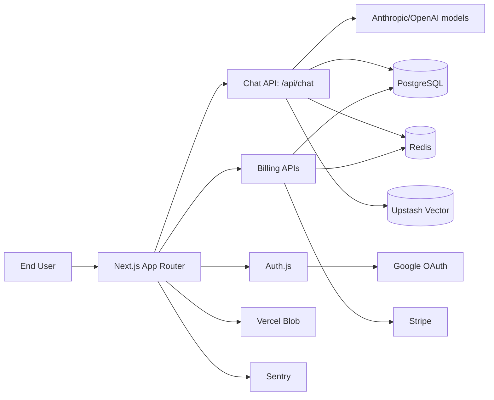
```mermaid
graph LR
  U[End User] --> N[Next.js App Router]
  N --> C[Chat API: /api/chat]
  N --> A[Auth.js]
  N --> B[Billing APIs]

  C --> M[Anthropic/OpenAI models]
  C --> P[(PostgreSQL)]
  C --> R[(Redis)]
  C --> V[(Upstash Vector)]

  A --> G[Google OAuth]

  B --> S[Stripe]
  B --> P
  B --> R

  N --> BL[Vercel Blob]
  N --> SE[Sentry]
```

## 3. High-Level Module Map

The platform is organized into a few high-value verticals.

- **Conversation execution**
  - `app/api/chat/route.ts`
  - `hooks/use-stream-recovery.ts`
  - `lib/stream/buffer-service.ts`
- **Knowledge retrieval and memory**
  - `lib/ai/user-rag.ts`, `lib/ai/org-rag.ts`, `lib/ai/persona-rag.ts`
  - `lib/ai/system-rag.ts`, `lib/ai/upstash-system-rag.ts`, `lib/ai/memory-rag.ts`
  - `lib/ai/context-assembler.ts`
- **Identity, authorization, and plans**
  - `app/(auth)/auth.ts`, `app/(auth)/auth.config.ts`, `middleware.ts`
  - `lib/organizations/*`, `lib/entitlements/index.ts`
- **Commercial and finance workflows**
  - `lib/billing/stripe.ts`, `lib/billing/grace-period.ts`
  - `app/api/billing/webhook/route.ts`, `app/api/cron/*`
- **Persistence model**
  - `lib/db/schema.ts`, `lib/db/queries.ts`, `lib/db/helpers/retry.ts`

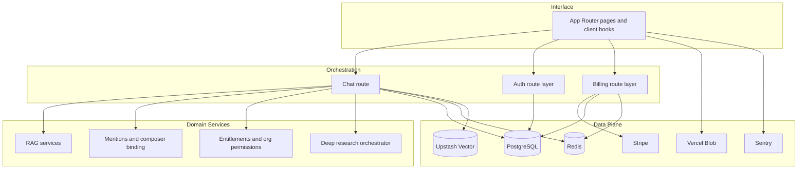
```mermaid
graph TD
  subgraph Interface
    UI[App Router pages and client hooks]
  end

  subgraph Orchestration
    CHAT[Chat route]
    AUTH[Auth route layer]
    BILL[Billing route layer]
  end

  subgraph Domain Services
    RAG[RAG services]
    MENTION[Mentions and composer binding]
    ENT[Entitlements and org permissions]
    DEEP[Deep research orchestrator]
  end

  subgraph Data Plane
    PG[(PostgreSQL)]
    REDIS[(Redis)]
    VEC[(Upstash Vector)]
    STRIPE[Stripe]
    BLOB[Vercel Blob]
    SENTRY[Sentry]
  end

  UI --> CHAT
  UI --> AUTH
  UI --> BILL
  CHAT --> RAG
  CHAT --> MENTION
  CHAT --> ENT
  CHAT --> DEEP
  CHAT --> PG
  CHAT --> REDIS
  CHAT --> VEC
  AUTH --> PG
  BILL --> STRIPE
  BILL --> PG
  BILL --> REDIS
  UI --> BLOB
  UI --> SENTRY
```

## 4. Chat Route And Streaming Architecture

Primary files:

- `app/api/chat/route.ts`
- `app/(chat)/api/chat/schema.ts`
- `lib/stream/buffer-service.ts`
- `lib/db/queries.ts`
- `hooks/use-stream-recovery.ts`

### 4.1 Request contract and guards

`POST /api/chat` validates a strict schema in `postRequestBodySchema` including:

- `id` (chat UUID), `message.parts` (AI SDK v5 part structure)
- model/provider/visibility selectors
- persona/profile selectors
- research mode (`off` or `nexus`)
- optional `composerDocumentId`

Before generation starts, the route enforces:

- authenticated session (`auth()`)
- per-plan chat daily quota via `getAccessContext()` and `usageCounters.chats_today`
- chat ownership for existing chats

### 4.2 End-to-end POST flow

1. Parse and validate request body with Zod.
2. Resolve/create chat record and title.
3. Load recent message window (`getRecentMessagesByChatId`, default last 50).
4. Extract explicit and implicit mentions (`MentionProcessor`, `SmartMentionDetector`).
5. Run RAG retrieval in parallel (company, user, org, persona, system, memory).
6. Persist user message (`saveMessages`).
7. Create stream state:
   - DB row via `createStreamId`
   - Redis buffer via `StreamBufferService.initializeStream`
8. Build final system prompt with all contexts and mention instructions.
9. Create streaming response via `createUIMessageStream`.
10. Branch:
   - `selectedResearchMode === 'nexus'`: run `runDeepResearch(...)`
   - otherwise: run `streamText(...)` with active tools
11. Persist assistant output and metadata, increment usage, trigger summarization, mark stream final state.

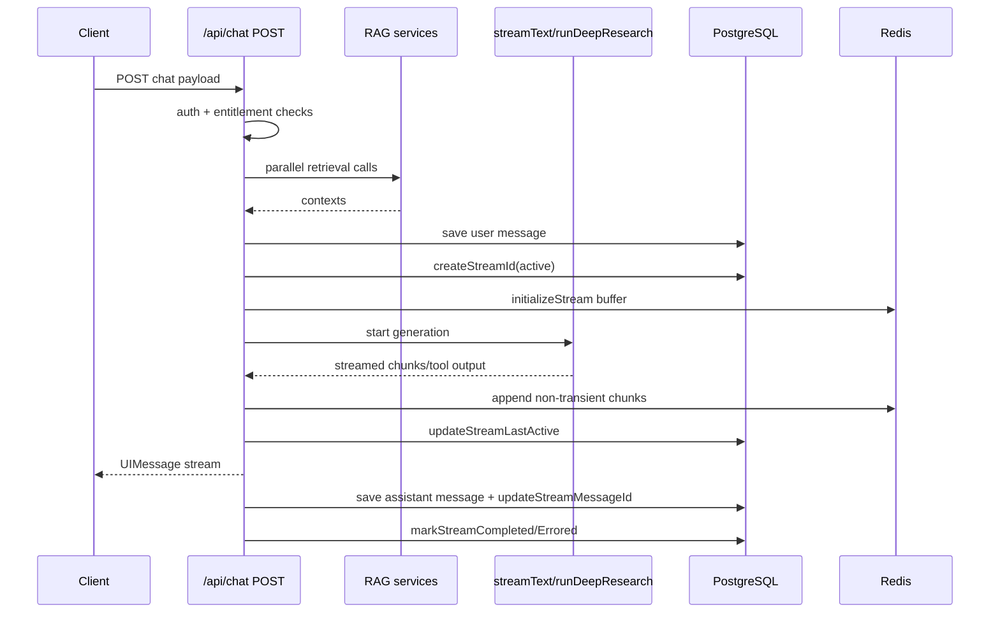
```mermaid
sequenceDiagram
  participant Client
  participant ChatAPI as /api/chat POST
  participant RAG as RAG services
  participant LLM as streamText/runDeepResearch
  participant DB as PostgreSQL
  participant Redis

  Client->>ChatAPI: POST chat payload
  ChatAPI->>ChatAPI: auth + entitlement checks
  ChatAPI->>RAG: parallel retrieval calls
  RAG-->>ChatAPI: contexts
  ChatAPI->>DB: save user message
  ChatAPI->>DB: createStreamId(active)
  ChatAPI->>Redis: initializeStream buffer
  ChatAPI->>LLM: start generation
  LLM-->>ChatAPI: streamed chunks/tool output
  ChatAPI->>Redis: append non-transient chunks
  ChatAPI->>DB: updateStreamLastActive
  ChatAPI-->>Client: UIMessage stream
  ChatAPI->>DB: save assistant message + updateStreamMessageId
  ChatAPI->>DB: markStreamCompleted/Errored
```

### 4.3 Tool invocation model

Standard mode uses `streamText` with configured tools and `experimental_activeTools`, including:

- `searchWeb`
- document tools (`createDocument`, `updateDocument`, `requestSuggestions`)
- weather and information tools (`getWeather`, `getInformation`, `addResource`)
- calendar suite (`getCalendarEvents`, `createCalendarEvent`, availability/conflict helpers)

Execution tuning includes:

- preflight model/token decision (`decideModelWithHaiku`)
- optional Anthropic thinking budget via `providerOptions.anthropic.thinking`
- step control via `stopWhen: stepCountIs(...)`
- optional first-step forced tool selection when preflight predicts document creation

### 4.4 Persistence and stream lifecycle

Stream state is tracked in both DB and Redis:

- DB table `Stream` (`status`, `lastActiveAt`, `messageId`, `metadata`)
- Redis list/state for buffered chunks and stream status

`StreamBufferService` details:

- chunk storage key pattern `stream:{streamId}:chunks`
- stream state key `stream:{streamId}:state`
- TTLs:
  - stream chunks/state: `3600s`
  - composer partial content: `1800s`

On successful completion, route actions include:

- `saveMessages` for assistant content and tool outputs
- `incrementUsageCounter('chats_today', 1)`
- `triggerBackgroundSummary(chatId)`
- `updateStreamMessageId(streamId, assistantId)`
- `markStreamCompleted` in DB and Redis buffer

On failures, route attempts:

- stream error marking (`markStreamErrored`)
- best-effort partial assistant message recovery

### 4.5 Recovery flow (GET route + client hook)

`GET /api/chat?chatId=...` supports resumability:

- checks active stream via `getActiveStreamByChatId`
- returns `204` when no active stream exists
- marks stale streams (`>60s inactive`) as interrupted
- returns buffered chunks and optional composer partial content

Client-side `useStreamRecovery` behavior:

- initial check on mount
- active polling every `500ms` with `fromSeq`
- on `204`, fetches persisted final messages via `/api/chats/messages`
- `applyRecoveredChunks(...)` rebuilds text from `text-delta` and data chunks

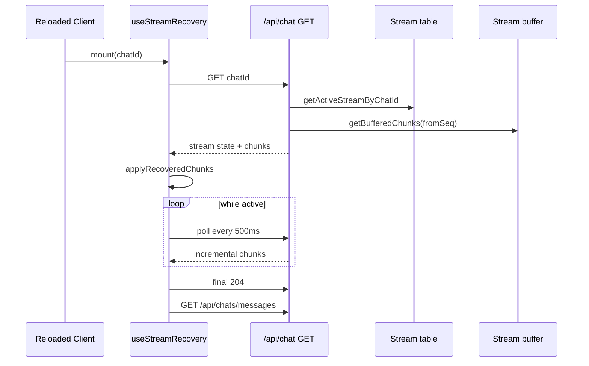
```mermaid
sequenceDiagram
  participant Page as Reloaded Client
  participant Hook as useStreamRecovery
  participant API as /api/chat GET
  participant DB as Stream table
  participant Redis as Stream buffer

  Page->>Hook: mount(chatId)
  Hook->>API: GET chatId
  API->>DB: getActiveStreamByChatId
  API->>Redis: getBufferedChunks(fromSeq)
  API-->>Hook: stream state + chunks
  Hook->>Hook: applyRecoveredChunks
  loop while active
    Hook->>API: poll every 500ms
    API-->>Hook: incremental chunks
  end
  Hook->>API: final 204
  Hook->>API: GET /api/chats/messages
```

## 5. Retrieval-Augmented Generation (RAG) Architecture

Primary files:

- `lib/ai/user-rag.ts`, `lib/ai/org-rag.ts`, `lib/ai/org-rag-context.ts`
- `lib/ai/persona-rag.ts`
- `lib/ai/system-rag.ts`, `lib/ai/upstash-system-rag.ts`
- `lib/ai/memory-rag.ts`
- `lib/ai/context-assembler.ts`

### 5.1 Storage and retrieval surfaces

- **User and org knowledge**: Upstash Vector namespaces
  - user namespace: user ID
  - org namespace: `org:{orgId}`
- **Persona overlays and some persona contexts**: Upstash namespaces
  - base persona namespace: `personaId`
  - overlay namespace: `overlay:{personaId}:{userId}`
- **System knowledge (general/course/system personas)**: PostgreSQL `SystemEmbeddings` with `vector(1536)`
- **EOS implementer profile knowledge**: Upstash namespaces mapped from profile IDs
- **Memory retrieval**: PostgreSQL `UserMemory` + `UserMemoryEmbedding` with `vector(1536)`

Shared embedding model in these paths is `openai.embedding('text-embedding-ada-002')`.

### 5.2 Ingestion pipelines

- `processUserDocument(...)`
  - sentence-based chunking (`chunkSize=1000`, `overlap=200`)
  - embed with `embedMany(...)`
  - upsert to Upstash namespace in batches
- `processOrgDocument(...)`
  - wrapper around user document ingestion using org namespace
- `processPersonaDocuments(...)` and `processPersonaOverlayDocuments(...)`
  - writes persona and overlay corpora into namespace-specific stores
- `processSystemDocument(...)` and `processUpstashSystemDocument(...)`
  - system persona corpora stored in PostgreSQL or Upstash depending on persona path

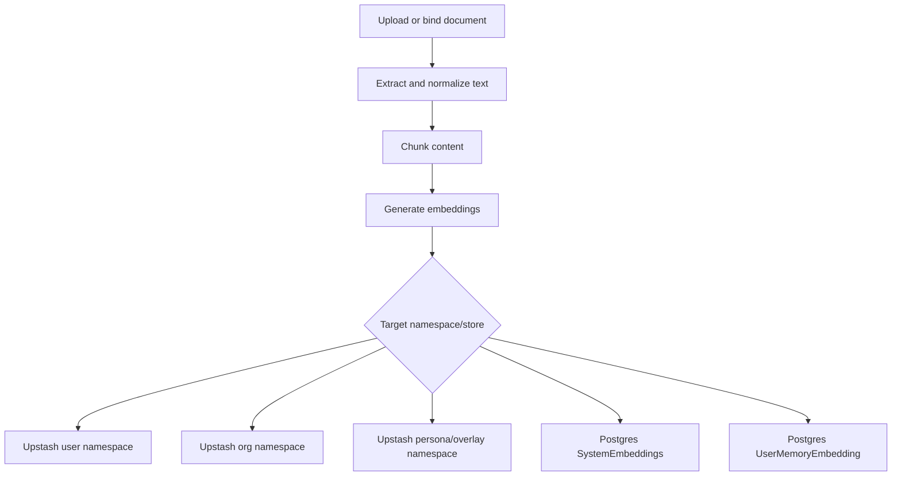
```mermaid
graph TD
  UP[Upload or bind document] --> EX[Extract and normalize text]
  EX --> CH[Chunk content]
  CH --> EMB[Generate embeddings]
  EMB --> SEL{Target namespace/store}
  SEL --> U1[Upstash user namespace]
  SEL --> U2[Upstash org namespace]
  SEL --> U3[Upstash persona/overlay namespace]
  SEL --> PG1[Postgres SystemEmbeddings]
  SEL --> PG2[Postgres UserMemoryEmbedding]
```

### 5.3 Retrieval behavior

`app/api/chat/route.ts` performs parallel retrieval for:

- company embedding context (`findRelevantContent`)
- user docs (`getUserRagContextWithMetadata`)
- org docs (`getOrgRagContextWithMetadata`)
- persona docs and overlay docs (`personaRagContextPrompt`)
- system persona content:
  - hardcoded EOS implementer path: `upstashSystemRagContextPrompt`
  - DB system persona path: `systemRagContextPrompt`
- memory retrieval:
  - semantic (`findRelevantMemories`)
  - recency (`getRecentMemories`)
  - merge + dedupe + formatting (`formatMemoriesForPrompt`)

Memory scoring combines:

- 70% vector similarity
- 20% memory confidence
- up to 10% recency boost

### 5.4 Context budgeting and prioritization

`assembleContextWithBudget(...)` provides adaptive token budgeting and priority-based inclusion with optional compression.

Priority order (low number = higher priority):

1. system
2. memory
3. persona
4. conversation summary
5. user docs
6. org docs
7. company context

If high-priority content does not fit, the assembler attempts `compressContext(...)`; lower-priority content is dropped.

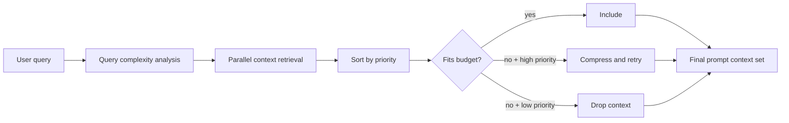
```mermaid
graph LR
  Q[User query] --> QA[Query complexity analysis]
  QA --> RET[Parallel context retrieval]
  RET --> SORT[Sort by priority]
  SORT --> BUDGET{Fits budget?}
  BUDGET -->|yes| INC[Include]
  BUDGET -->|no + high priority| COMP[Compress and retry]
  BUDGET -->|no + low priority| DROP[Drop context]
  INC --> FINAL[Final prompt context set]
  COMP --> FINAL
  DROP --> FINAL
```

## 6. Personas, Profiles, Mentions, And Composer Integrations

Primary files:

- `lib/ai/persona-rag.ts`
- `lib/ai/mention-processor.ts`, `lib/ai/smart-mention-detector.ts`
- `lib/mentions/service.ts`, `lib/mentions/composer-fetcher.ts`
- `lib/organizations/permissions.ts`

### 6.1 Persona and profile behavior

- `Persona` supports private/org visibility, system persona flags, and optional user overlay controls.
- `PersonaProfile` provides profile-specific sub-context with own `knowledgeNamespace`.
- Access is centralized in `canAccessPersona(...)`:
  - system personas are chat-accessible but not user-editable
  - owners have full access
  - org-shared access depends on org role and permissions

### 6.2 User overlays and persona knowledge composition

`personaRagContextPrompt(...)` composes persona context from:

- base persona docs
- optional user overlay instructions
- optional user overlay docs

It filters retrieval results against linked document IDs, then emits grouped context with priority instructions.

### 6.3 Mentions and implicit intent detection

Mentions are handled in two layers:

- explicit parsing and tool intent mapping (`MentionProcessor`)
- implicit regex/heuristic detection (`SmartMentionDetector`)

`MentionProcessor` outputs:

- `toolsToActivate`
- context payload
- enriched mention instructions
- composer edit detection and extracted edit instruction

### 6.4 Composer mention ecosystem

`MentionService` maintains:

- static resources and shortcuts (calendar, docs, scorecard, VTO, tool commands, composer types)
- dynamic resolvers for calendar/docs/team/composer items

Composer lookups are injected through `setComposerFetcher(...)`, then resolved by `fetchComposersForMention(...)` using:

- search on title/summary/tags
- kind filters
- sorting by access/recency/mentions/title

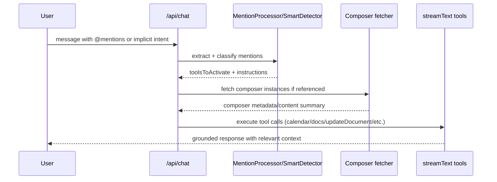
```mermaid
sequenceDiagram
  participant User
  participant ChatAPI as /api/chat
  participant Mention as MentionProcessor/SmartDetector
  participant Composer as Composer fetcher
  participant Tools as streamText tools

  User->>ChatAPI: message with @mentions or implicit intent
  ChatAPI->>Mention: extract + classify mentions
  Mention-->>ChatAPI: toolsToActivate + instructions
  ChatAPI->>Composer: fetch composer instances if referenced
  Composer-->>ChatAPI: composer metadata/content summary
  ChatAPI->>Tools: execute tool calls (calendar/docs/updateDocument/etc.)
  Tools-->>User: grounded response with relevant context
```

## 7. Authentication, Authorization, Organizations, And Entitlements

Primary files:

- `app/(auth)/auth.ts`, `app/(auth)/auth.config.ts`
- `middleware.ts`
- `lib/organizations/permissions.ts`, `lib/organizations/invite-codes.ts`, `lib/organizations/seat-enforcement.ts`
- `lib/entitlements/index.ts`

### 7.1 Authentication

- Auth stack is Auth.js (`next-auth`) with:
  - Google OAuth provider
  - Credentials provider with password verification (`verifyPassword`)
- JWT and session callbacks hydrate `id`, `type`, and `profilePicture`.
- Cookie config includes secure variants and explicit CSRF token cookie (`authjs.csrf-token` naming by env).
- Guest entry endpoint (`app/(auth)/api/auth/guest/route.ts`) redirects to `/login` rather than issuing a guest session.

### 7.2 Middleware protection

`middleware.ts` enforces:

- same-origin checks for state-changing API requests (POST/PUT/PATCH/DELETE)
- explicit exceptions for auth, billing webhooks, and cron routes
- route-level auth redirects for protected paths

### 7.3 Organization RBAC and lifecycle controls

- Roles: `owner`, `admin`, `member`
- Role-permission map in `rolePermissions`
- `checkOrgPermission(...)` and `requireOrgPermission(...)` enforce capability checks
- `canManageUser(...)` guards member removal/role updates with owner constraints

Invite code flow:

- `generateInviteCode(...)` issues 6-char codes in Redis (`org:invite:{code}`)
- 7-day TTL (`INVITE_CODE_TTL`)
- `validateInviteCode(...)` handles expiration and max-use counters

Seat management flow:

- `hasAvailableSeats(...)` / `enforceSeatLimit(...)` guard join operations
- `updateOrgSeatCount(...)` syncs seat count from billing events
- if seats drop below usage, `pendingRemoval` is set for admin remediation

### 7.4 Entitlements and usage accounting

`lib/entitlements/index.ts` provides:

- base feature maps by plan (`free`, `pro`, `business`)
- merged overrides (`computeEntitlements`)
- cached entitlements (`entitlements:{userId}:{PLAN_VERSION}`; TTL 10m)
- normalized usage counters and atomic increments (`incrementUsageCounter`)
- daily/monthly reset jobs (`resetDailyUsageCounters`, `resetMonthlyUsageCounters`)

Deep research concurrency/rate control:

- `reserveDeepResearchSlot(...)` uses Redis token-bucket + active-counter keys
- fallback in-memory bucket if Redis is unavailable

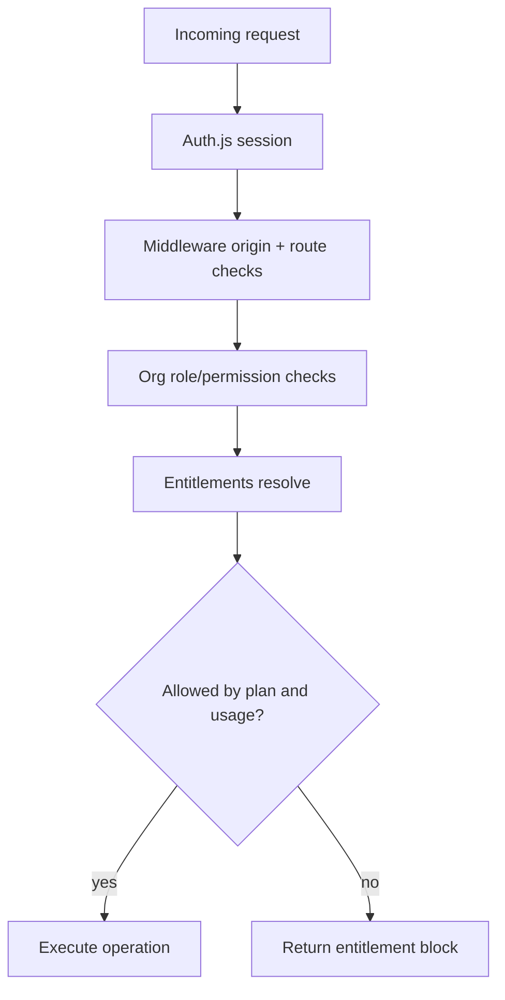
```mermaid
graph TD
  Req[Incoming request] --> Auth[Auth.js session]
  Auth --> MW[Middleware origin + route checks]
  MW --> Org[Org role/permission checks]
  Org --> Ent[Entitlements resolve]
  Ent --> Gate{Allowed by plan and usage?}
  Gate -->|yes| Exec[Execute operation]
  Gate -->|no| Block[Return entitlement block]
```

## 8. Billing And Subscription Lifecycle

Primary files:

- `app/api/billing/webhook/route.ts`
- `lib/billing/stripe.ts`
- `lib/billing/grace-period.ts`
- `lib/billing/subscription-health.ts`
- `app/api/cron/grace-period-reminders/route.ts`
- `app/api/cron/subscription-health-check/route.ts`

### 8.1 Checkout and portal entry points

`createCheckoutSession(...)`:

- validates authenticated user/org constraints
- resolves Stripe price by plan/interval
- sets metadata (`user_id`, `plan`, optional `org_id`, `seats`)
- for business plans, quantity maps to seat count

`createCustomerPortalSession(...)`:

- requires existing Stripe customer
- links portal return URL back to app

### 8.2 Webhook processing model

Webhook route:

- runtime `nodejs`, dynamic forced
- guarded by `FEATURE_FLAGS.stripe_mvp`
- verifies Stripe signature with `constructStripeEvent(...)`

`handleStripeWebhook(...)` reliability controls:

- dedupe via `WebhookEvents` table (`hasWebhookBeenProcessed`)
- mark processed after handling
- per-subscription Redis lock (`subscription:lock:{subscription.id}`) to avoid concurrent mutation

Handled events include:

- checkout completion
- subscription created/updated/deleted/paused/resumed
- invoice payment failure
- payment intent requires action/succeeded
- customer updates

Seat synchronization:

- on quantity changes in `customer.subscription.updated`, org seat counts are reconciled via `updateOrgSeatCount(...)`

### 8.3 Grace period and automated health checks

Grace period model:

- 7-day Redis-tracked grace window (`grace_period:{entityType}:{entityId}`)
- reminders at 7/3/1 days
- expiry cleanup downgrades user/org plans and invalidates entitlement caches

Automations:

- usage reset cron routes secured by `CRON_SECRET`
- grace period reminder + cleanup cron
- subscription health scan and optional autofix cron

`subscription-health` detects:

- double billing
- missing/orphaned Stripe records
- seat mismatches
- metadata/plan mismatches

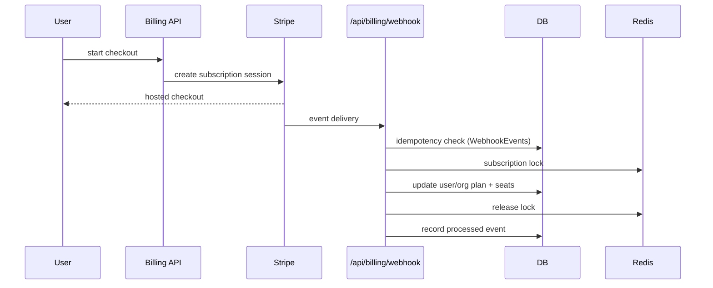
```mermaid
sequenceDiagram
  participant User
  participant App as Billing API
  participant Stripe
  participant Webhook as /api/billing/webhook
  participant DB
  participant Redis

  User->>App: start checkout
  App->>Stripe: create subscription session
  Stripe-->>User: hosted checkout
  Stripe->>Webhook: event delivery
  Webhook->>DB: idempotency check (WebhookEvents)
  Webhook->>Redis: subscription lock
  Webhook->>DB: update user/org plan + seats
  Webhook->>Redis: release lock
  Webhook->>DB: record processed event
```

## 9. Data Model And Persistence Hotspots

Primary file: `lib/db/schema.ts`

### 9.1 Core relational graph

- `User` -> optional `Org`
- `Chat` -> `User`, optional `Persona`, optional `PersonaProfile`
- `Message_v2` -> `Chat`
- `Stream` -> `Chat` + optional assistant `messageId`
- persona ecosystem: `Persona`, `PersonaProfile`, `PersonaDocument`, `PersonaUserOverlay`, `PersonaUserOverlayDocument`
- org ecosystem: `OrgMemberRole`, `OrgInvitation`, `OrgDocument`
- billing idempotency: `WebhookEvents`

### 9.2 JSONB and vector hotspots

JSON/JSONB-heavy fields:

- `User.entitlements`, `User.usageCounters`
- `Org.limits`
- `Stream.metadata`
- document metadata, tags, context linkage fields

Vector-heavy tables (all `dimensions: 1536`):

- `Embeddings` (composer/general document embeddings)
- `SystemEmbeddings` (system/course knowledge)
- `UserMemoryEmbedding` (memory retrieval)

### 9.3 Persistence patterns with high behavioral impact

- message upsert path uses `onConflictDoUpdate` and retry wrappers (`executeWithRetry`)
- stream lifecycle updates are stateful (`active -> completed/interrupted/errored`)
- chat history uses sliding window retrieval with total count for summary-trigger behavior
- context-usage telemetry is persisted in `ContextUsageLog` for RAG effectiveness tracing

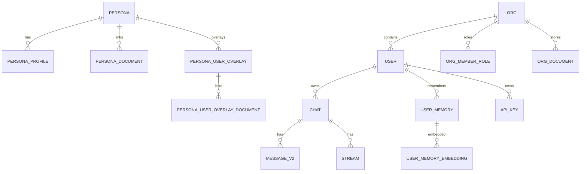
```mermaid
erDiagram
  USER ||--o{ CHAT : owns
  ORG ||--o{ USER : contains
  CHAT ||--o{ MESSAGE_V2 : has
  CHAT ||--o{ STREAM : has
  PERSONA ||--o{ PERSONA_PROFILE : has
  PERSONA ||--o{ PERSONA_DOCUMENT : links
  PERSONA ||--o{ PERSONA_USER_OVERLAY : overlays
  PERSONA_USER_OVERLAY ||--o{ PERSONA_USER_OVERLAY_DOCUMENT : links
  ORG ||--o{ ORG_MEMBER_ROLE : roles
  ORG ||--o{ ORG_DOCUMENT : stores
  USER ||--o{ USER_MEMORY : remembers
  USER_MEMORY ||--o{ USER_MEMORY_EMBEDDING : embedded
  USER ||--o{ API_KEY : owns
```

## 10. Reliability, Error Handling, And Observability

Primary files:

- `lib/errors/api-wrapper.ts`, `lib/errors/classifier.ts`, `lib/errors/types.ts`
- `lib/db/helpers/retry.ts`
- `app/global-error.tsx`, `components/error-boundary.tsx`
- `instrumentation.ts`, `sentry.server.config.ts`, `sentry.edge.config.ts`, `instrumentation-client.ts`

### 10.1 Error classification and API response shaping

API routes can be wrapped in `withErrorHandler(...)`, which:

- classifies errors by category/severity/retryability
- emits consistent JSON error envelopes
- sets HTTP status and optional `Retry-After` where appropriate

Classifier covers key categories:

- network/auth/rate-limit/validation/database/AI-streaming/file-operation/permission/business-logic/unknown

### 10.2 Database resiliency

`executeWithRetry(...)` applies:

- retryable-error detection by message patterns and Postgres codes
- exponential backoff with jitter
- bounded retries (default 3)

### 10.3 Runtime fault containment

- chat route marks stream errors and attempts partial-message persistence
- stale stream detection converts ghost-active sessions to interrupted
- global and component-level boundaries prevent app-wide crash loops and report to Sentry

### 10.4 Observability surface

Sentry coverage includes:

- server runtime init
- edge runtime init
- client init with replay and filtering for known benign errors
- request-level capture (`onRequestError`)

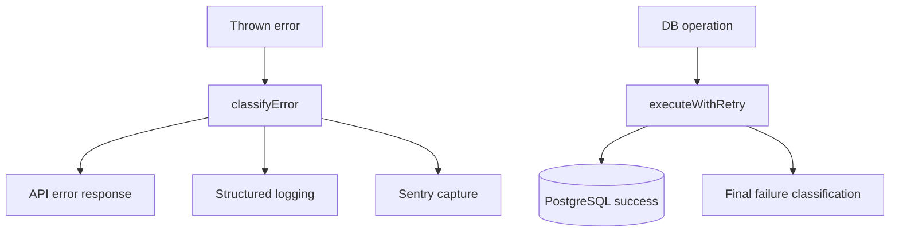
```mermaid
graph TD
  ERR[Thrown error] --> CLASS[classifyError]
  CLASS --> RESP[API error response]
  CLASS --> LOG[Structured logging]
  CLASS --> SNT[Sentry capture]
  DBOP[DB operation] --> RETRY[executeWithRetry]
  RETRY --> DBOK[(PostgreSQL success)]
  RETRY --> DBFAIL[Final failure classification]
```

## 11. Testing, Build, And Runtime Operations

Primary operational definitions are in `package.json`, `playwright.config.ts`, `vitest.component.config.ts`, and `next.config.ts`.

### 11.1 Build and run

- dev server: `pnpm dev`
- build: `pnpm build` (runs `tsx lib/db/migrate` before Next build)
- production start: `pnpm start`

### 11.2 Quality and test commands

- lint: `pnpm lint`
- lint autofix: `pnpm lint:fix`
- e2e tests: `pnpm test` (Playwright)
- unit tests: `pnpm test:unit` (Vitest)
- component-focused Vitest config includes jsdom setup and coverage output to `coverage/components`

### 11.3 Playwright runtime profile

`playwright.config.ts` runs against local app with:

- test dir `./tests`
- projects for `e2e` and `routes`
- local webserver boot via `pnpm dev`
- base URL from `PORT` with `/ping` health probe

### 11.4 Runtime configuration highlights

- Sentry is integrated through `withSentryConfig(...)` in `next.config.ts`
- build is configured to ignore ESLint failures at build time (`eslint.ignoreDuringBuilds`)
- image remote patterns include blob and avatar hosts
- security/perf headers include DNS prefetch and immutable static cache headers

## 12. Known Constraints

- Chat orchestration is concentrated in a very large single route file (`app/api/chat/route.ts`), increasing change risk.
- Streaming resumability uses dual state (DB + Redis), while comments indicate protocol caveats around AI SDK v5 and resumable stream compatibility.
- System knowledge is split across two storage patterns (Postgres and Upstash), adding operational complexity.
- Document extraction quality varies by file type; PDFs may fall back to model-assisted reconstruction when parsing is weak.
- Billing correctness depends on both DB idempotency and Redis locks; either layer failing can reduce protection.
- Some mention-service dynamic fetchers remain stubs (calendar/docs/team), so behavior depends on injected fetchers.

---

## 13. Follow-Up Implementation Program

This program converts the six recommended follow-up items into implementation-grade specifications. Each workstream includes current-state analysis grounded in specific code paths, target architecture with explicit service boundaries, deterministic test blueprints, rollout phases, and risk analysis.

### 13.0 Program Overview and Dependency Map

The six workstreams are ordered by dependency. Workstream 6 (RAG namespace source map) is a foundational reference used by workstreams 1 and 2. Workstream 1 (chat route extraction) produces the service boundaries that workstreams 3 and 5 test against. Workstreams 4 and 5 (webhook and org/entitlements testing) are independent of each other but share billing-domain fixtures.

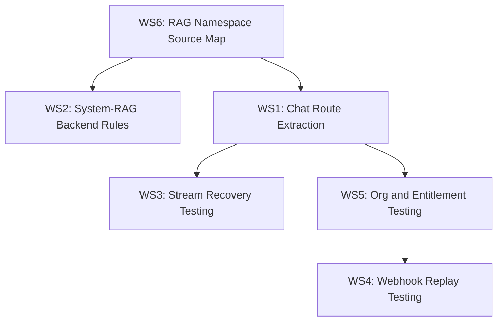
```mermaid
graph TD
  WS6["WS6: RAG Namespace Source Map"] --> WS2["WS2: System-RAG Backend Rules"]
  WS6 --> WS1["WS1: Chat Route Extraction"]
  WS1 --> WS3["WS3: Stream Recovery Testing"]
  WS1 --> WS5["WS5: Org and Entitlement Testing"]
  WS4["WS4: Webhook Replay Testing"]
  WS5 --> WS4
```

Recommended execution order:

1. WS6 -- RAG namespace source map (zero code changes; reference documentation)
2. WS2 -- formalize system-RAG backend selection (light refactor, adds decision function)
3. WS1 -- chat route extraction (largest code change; creates new service modules)
4. WS3 -- stream recovery integration tests (depends on extracted stream lifecycle service)
5. WS4 -- webhook deterministic replay tests (independent of WS1-3)
6. WS5 -- org-role and entitlement edge-case tests (shares billing fixtures with WS4)

---

### 13.1 WS1 -- Chat Route Orchestration Extraction

#### 13.1.1 Current state

`app/api/chat/route.ts` is a single file exceeding 3,700 lines. It owns all of the following responsibilities inline:

- **Request validation and auth**: Zod `postRequestBodySchema`, `auth()`, `getAccessContext()`, chat ownership
- **Chat lifecycle**: `getChatById`, `saveChat`, `generateTitleFromUserMessage`, EOS metadata
- **Message loading**: `getRecentMessagesByChatId`, v4-to-v5 conversion, deduplication
- **RAG orchestration**: six parallel retrieval calls (company, user, org, persona, system, memory)
- **Mention processing**: `MentionProcessor.extractMentions`, `SmartMentionDetector.detectImplicitMentions`, `MentionProcessor.processMentions`
- **Context assembly**: `systemPrompt()`, `buildCalendarPromptAdditions`, inline docs, mention instructions
- **Model selection**: `decideModelWithHaiku()` preflight
- **Stream lifecycle**: `createStreamId`, `StreamBufferService.initializeStream`, mark completed/errored/interrupted, `updateStreamLastActive`
- **Response generation**: `streamText()` vs `runDeepResearch()` branching, tool wiring
- **Stream buffering**: `StreamBufferService.appendChunk`, composer partial saves
- **Message persistence**: `saveMessages`, `updateStreamMessageId`, partial message recovery
- **Post-generation**: `incrementUsageCounter`, `triggerBackgroundSummary`, Nexus metadata cleanup
- **GET handler**: stream recovery, stale detection, chunk replay

#### 13.1.2 Target architecture

Extract seven focused service modules from the route. The route file becomes a thin orchestrator that delegates to each service.

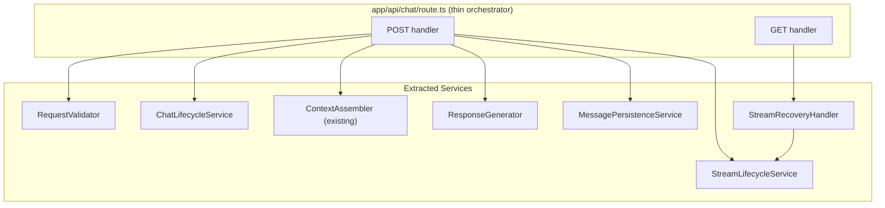
```mermaid
graph TD
  subgraph route ["app/api/chat/route.ts (thin orchestrator)"]
    POST[POST handler]
    GET[GET handler]
  end

  subgraph services [Extracted Services]
    RV["RequestValidator"]
    CL["ChatLifecycleService"]
    CA["ContextAssembler (existing)"]
    SL["StreamLifecycleService"]
    RG["ResponseGenerator"]
    MP["MessagePersistenceService"]
    SR["StreamRecoveryHandler"]
  end

  POST --> RV
  POST --> CL
  POST --> CA
  POST --> SL
  POST --> RG
  POST --> MP
  GET --> SR
  SR --> SL
```

Proposed service boundaries:

- **`lib/chat/request-validator.ts`** (`RequestValidator`)
  - Input: raw `Request`, `auth()` session
  - Output: validated `ChatRequest` DTO, `AccessContext`
  - Responsibilities: Zod parse, session check, ownership check, daily-quota guard
  - Contract: throws `ChatValidationError` on failure; returns `{ chatRequest, accessContext }` on success

- **`lib/chat/chat-lifecycle.ts`** (`ChatLifecycleService`)
  - Input: `ChatRequest`, `AccessContext`
  - Output: resolved `Chat` record, message window, title
  - Responsibilities: `getChatById` / `saveChat`, title generation, EOS metadata, `getRecentMessagesByChatId`, conversation summary
  - Contract: returns `{ chat, recentMessages, conversationSummary }` or throws `ChatNotFoundError`

- **`lib/ai/context-assembler.ts`** (existing; no structural change)
  - Already extracted. Orchestrates parallel RAG calls, mention processing, budget-aware assembly.
  - Receives `{ query, personaId, profileId, userId, orgId, recentMessages }`.
  - Returns assembled system prompt and activated tools.

- **`lib/stream/stream-lifecycle.ts`** (`StreamLifecycleService`)
  - Input: `chatId`, optional `composerDocumentId`
  - Output: `streamId`, initialized `StreamBufferService`
  - Responsibilities: `createStreamId` in DB, `StreamBufferService.initializeStream` in Redis, `markStreamCompleted`, `markStreamErrored`, `markStreamInterrupted`, `updateStreamLastActive`, `updateStreamMessageId`
  - Contract: returns `{ streamId, buffer }` on init; state-transition methods are idempotent

- **`lib/chat/response-generator.ts`** (`ResponseGenerator`)
  - Input: system prompt, model config, tool set, stream buffer, `researchMode`
  - Output: streamed response (delegates to `streamText` or `runDeepResearch`)
  - Responsibilities: `decideModelWithHaiku` preflight, `streamText` / `runDeepResearch` invocation, step control, forced tool selection, chunk buffering to Redis
  - Contract: returns an `AsyncIterable` of response events; throws on generation failure

- **`lib/chat/message-persistence.ts`** (`MessagePersistenceService`)
  - Input: user message parts, assistant output, `streamId`, `chatId`
  - Output: persisted message IDs
  - Responsibilities: `saveMessages` (user + assistant), `updateStreamMessageId`, partial-message recovery on error, `incrementUsageCounter`, `triggerBackgroundSummary`
  - Contract: returns `{ userMessageId, assistantMessageId }` or `{ partialMessageId }` on error recovery

- **`lib/stream/recovery-handler.ts`** (`StreamRecoveryHandler`)
  - Input: `chatId`, optional `fromSeq`
  - Output: recovery response (chunks + metadata) or `204`
  - Responsibilities: `getActiveStreamByChatId`, stale detection (60s threshold), `markStreamInterrupted`, buffered chunk replay, composer partial content
  - Contract: returns `{ streamId, chunks, metadata, isActive, isStale }` or `null` (204 case)

#### 13.1.3 Contract test design

Each extracted service gets a Vitest contract test file that verifies:

- **RequestValidator**
  - Scenario: valid payload with all fields -> returns `ChatRequest` and `AccessContext`
  - Scenario: missing `id` field -> throws `ChatValidationError` with Zod details
  - Scenario: unauthenticated session -> throws auth error
  - Scenario: daily quota exceeded -> throws entitlement error
  - Scenario: chat owned by different user -> throws ownership error

- **ChatLifecycleService**
  - Scenario: new chat ID -> creates chat record, generates title
  - Scenario: existing chat ID -> resolves existing record
  - Scenario: non-existent chat ID for existing reference -> throws `ChatNotFoundError`
  - Scenario: message window returns last 50 messages sorted by creation time

- **StreamLifecycleService**
  - Scenario: `initialize()` -> DB row with `status: active`, Redis state initialized
  - Scenario: `markCompleted()` -> DB status `completed`, Redis state `completed`, idempotent on double call
  - Scenario: `markErrored()` -> DB status `errored`, Redis state `errored`
  - Scenario: `markInterrupted()` -> DB status `interrupted`, Redis state `interrupted`
  - Scenario: `updateLastActive()` -> DB `lastActiveAt` updated, Redis state refreshed
  - Scenario: Redis unavailable -> DB-only state management, no throw

- **ResponseGenerator**
  - Scenario: standard mode -> calls `streamText` with correct tools and model
  - Scenario: nexus mode -> delegates to `runDeepResearch`
  - Scenario: preflight predicts document creation -> forced tool selection in first step
  - Scenario: generation error -> propagated cleanly for caller error handling

- **MessagePersistenceService**
  - Scenario: successful generation -> saves user + assistant messages, increments counter
  - Scenario: partial failure -> saves partial assistant message, does not increment counter
  - Scenario: `triggerBackgroundSummary` invoked after successful persist

- **StreamRecoveryHandler**
  - Scenario: no active stream -> returns `null` (caller sends 204)
  - Scenario: active, fresh stream -> returns buffered chunks with `isActive: true`
  - Scenario: active, stale stream (>60s) -> marks interrupted, returns `isStale: true`
  - Scenario: `fromSeq` provided -> returns only chunks after that sequence number
  - Scenario: composer document present -> includes `partialContent` in metadata

#### 13.1.4 Rollout phases

- **Phase 1**: Extract `StreamLifecycleService` and `StreamRecoveryHandler` (lowest coupling to other route logic). Write contract tests. Route delegates to new modules.
- **Phase 2**: Extract `RequestValidator` and `ChatLifecycleService`. Write contract tests. Route delegates.
- **Phase 3**: Extract `ResponseGenerator` and `MessagePersistenceService`. Write contract tests. Route becomes a thin orchestrator.
- **Phase 4**: Remove dead inline code from route. Verify all existing E2E tests (`tests/routes/chat.test.ts`, `tests/e2e/chat.spec.ts`) pass without modification.

#### 13.1.5 Risks and observability

- **Risk**: extraction introduces import-order or initialization-timing regressions. **Mitigation**: each phase runs the full E2E suite before merging.
- **Risk**: Sentry context is lost across module boundaries. **Mitigation**: pass Sentry transaction/span context as parameter to each service.
- **Risk**: Redis client initialization races in new modules. **Mitigation**: use the existing lazy `getRedisClient()` singleton pattern.
- **Observability**: add `console.log` breadcrumbs at service boundaries (request ID, service name, operation) to maintain debuggability during transition.

---

### 13.2 WS2 -- System-RAG Backend Selection Formalization

#### 13.2.1 Current state

The system-RAG backend is selected by two independent code paths with inconsistent checks:

- **Chat route** (`app/api/chat/route.ts`): if `selectedPersonaId === 'eos-implementer'` (string literal) then Upstash via `upstashSystemRagContextPrompt`; else if persona exists in DB and `persona.isSystemPersona` then Postgres via `systemRagContextPrompt`.
- **Context assembler** (`lib/ai/context-assembler.ts`): same string-literal check for `eos-implementer`; else if `personaData?.isSystemPersona`, checks for circle-course persona (Upstash persona-RAG path), else Postgres `systemRagContextPrompt`.

Problems:

- EOS Implementer is identified only by the string `'eos-implementer'`, not by UUID `00000000-0000-0000-0000-000000000001`. If the client sends the UUID, the Upstash path is silently skipped and Postgres is used (returning empty results).
- Circle-course personas use the persona-RAG path (`getCircleCourseContext` in Upstash) rather than the system-RAG path, but the distinction is not formally documented.
- There is no fallback: if Upstash fails for EOS Implementer, the code returns empty context rather than falling back to Postgres.
- The chat route does not use `assembleContextWithBudget`; it runs its own parallel RAG calls. Backend selection logic is therefore duplicated.

#### 13.2.2 Target architecture

Introduce a single deterministic function `resolveSystemRagBackend(...)` that encapsulates all selection logic:

```
function resolveSystemRagBackend(params: {
  personaId: string;
  profileId?: string;
  isSystemPersona: boolean;
  knowledgeNamespace?: string;
}): {
  backend: 'upstash' | 'postgres' | 'upstash-persona' | 'none';
  namespace: string;
  fallbackBackend?: 'postgres' | 'none';
}
```

Decision rules (in order of precedence):

1. `personaId === 'eos-implementer'` OR `personaId === '00000000-0000-0000-0000-000000000001'` -> backend `upstash`, namespace from profile-namespace map, fallback `none`
2. `knowledgeNamespace` starts with `circle-course-` -> backend `upstash-persona`, namespace = `knowledgeNamespace`, fallback `none`
3. `isSystemPersona === true` -> backend `postgres`, namespace from `persona.knowledgeNamespace` or `profile.knowledgeNamespace`, fallback `none`
4. otherwise -> backend `none`

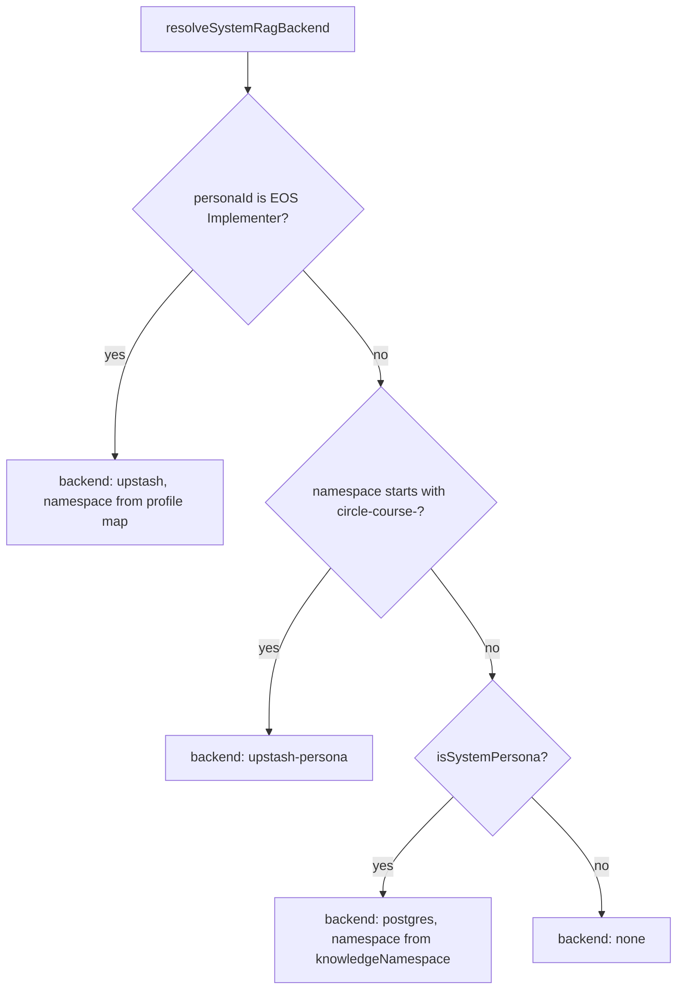
```mermaid
graph TD
  Start["resolveSystemRagBackend"] --> Q1{"personaId is EOS Implementer?"}
  Q1 -->|yes| UP1["backend: upstash, namespace from profile map"]
  Q1 -->|no| Q2{"namespace starts with circle-course-?"}
  Q2 -->|yes| UP2["backend: upstash-persona"]
  Q2 -->|no| Q3{"isSystemPersona?"}
  Q3 -->|yes| PG["backend: postgres, namespace from knowledgeNamespace"]
  Q3 -->|no| NONE["backend: none"]
```

Both the chat route and context assembler call `resolveSystemRagBackend` instead of inlining the decision. This eliminates duplication and the string-only matching bug.

#### 13.2.3 EOS Implementer profile-to-namespace map

This map is currently hardcoded in `lib/ai/upstash-system-rag.ts`:

- `quarterly-session-facilitator` -> `eos-implementer-quarterly-session`
- `focus-day-facilitator` -> `eos-implementer-focus-day`
- `vision-building-day-1` -> `eos-implementer-vision-day-1`
- `vision-building-day-2` -> `eos-implementer-vision-day-2`

The formalized function uses this map. Unrecognized profile IDs return namespace `eos-implementer-general` (fallback).

#### 13.2.4 Cache and performance behavior

`upstash-system-rag.ts` uses an in-memory cache:

- TTL: `SYSTEM_RAG_CACHE_TTL_MS = 5 * 60 * 1000` (5 minutes)
- Max entries: `SYSTEM_RAG_CACHE_MAX_SIZE = 100`
- Cache key: `{namespace}:{normalizedQuery}:{limit}:{threshold}`
- Eviction: sweep expired first, then LRU (evict oldest Map entry)

Postgres system RAG (`system-rag.ts`) has no cache. Retrieval hits the database on every call with cosine similarity via `pgvector`.

#### 13.2.5 Contract test design

- Scenario: `personaId = 'eos-implementer'`, `profileId = 'quarterly-session-facilitator'` -> `{ backend: 'upstash', namespace: 'eos-implementer-quarterly-session' }`
- Scenario: `personaId = '00000000-0000-0000-0000-000000000001'` (UUID) -> same result as string literal
- Scenario: `personaId = 'some-uuid'`, `knowledgeNamespace = 'circle-course-abc'` -> `{ backend: 'upstash-persona', namespace: 'circle-course-abc' }`
- Scenario: `personaId = 'some-uuid'`, `isSystemPersona = true`, `knowledgeNamespace = 'eos-l10'` -> `{ backend: 'postgres', namespace: 'eos-l10' }`
- Scenario: `personaId = 'some-uuid'`, `isSystemPersona = false` -> `{ backend: 'none' }`
- Scenario: unknown profile ID for EOS Implementer -> namespace defaults to `eos-implementer-general`

#### 13.2.6 Risks

- **Risk**: changing selection logic breaks EOS Implementer retrieval in production. **Mitigation**: deploy behind feature flag; shadow-test both old and new paths for one release cycle.
- **Risk**: normalizing UUID match introduces false positives. **Mitigation**: only the specific EOS Implementer UUID is matched; all other UUIDs fall through.

---

### 13.3 WS3 -- Stream Recovery Integration Testing

#### 13.3.1 Current test coverage

Existing tests in `tests/routes/chat.test.ts`:

- POST: empty body 400, basic generation, auth (403 for other user), delete
- GET: 404 for non-existent chat, resume during active stream, no resume when stream ended, 403 for private chat resume by other user, 200 for public chat resume by other user

Missing coverage:

- Stale-stream transition (stream `lastActiveAt` > 60s ago)
- Partial composer recovery (`ComposerContentBuffer.getPartialContent`)
- `useStreamRecovery` client hook (no tests at all)
- `StreamBufferService` unit tests (no tests at all)
- `ComposerContentBuffer` unit tests (no tests at all)
- `fromSeq` incremental chunk delivery
- `applyRecoveredChunks` text-delta accumulation
- `getRecoveredComposerState` extraction
- `__finalMessages` marker handling
- `cleanupStaleStreams` cron behavior

#### 13.3.2 Stream state machine

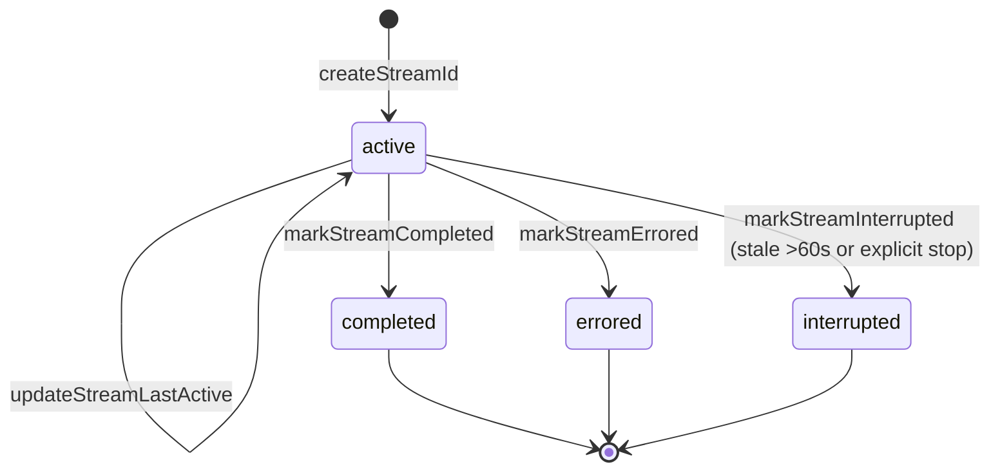
```mermaid
stateDiagram-v2
  [*] --> active: createStreamId
  active --> active: updateStreamLastActive
  active --> completed: markStreamCompleted
  active --> errored: markStreamErrored
  active --> interrupted: markStreamInterrupted (stale >60s or explicit stop)
  completed --> [*]
  errored --> [*]
  interrupted --> [*]
```

Key invariants:

- Only `active` streams can transition to other states.
- `markStreamCompleted` is the only path that sets `messageId` on the stream record.
- `markStreamInterrupted` is triggered by the GET handler when `lastActiveAt` exceeds the 60-second threshold, or by the explicit stop endpoint (`/api/chat/[id]/stop`).
- `cleanupStaleStreams` (cron) batch-marks streams inactive for >30 minutes as `interrupted`.
- All transitions are idempotent (double-calling does not throw).

#### 13.3.3 Recovery sequence detail

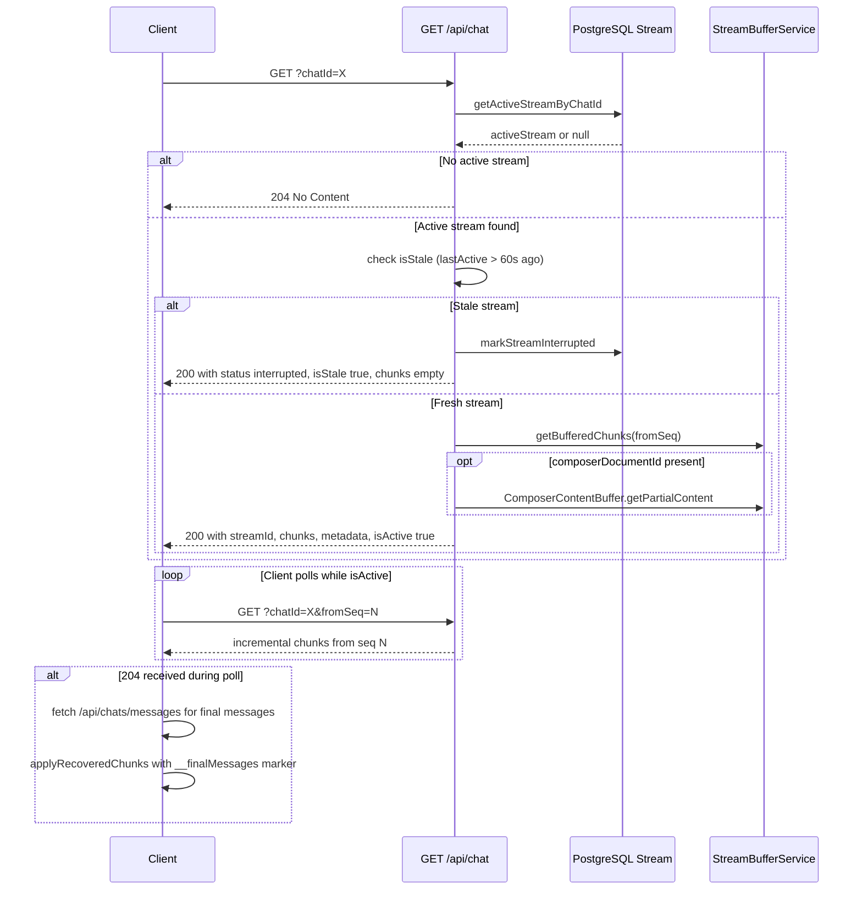
```mermaid
sequenceDiagram
  participant C as Client
  participant GET as GET /api/chat
  participant DB as PostgreSQL Stream
  participant Redis as StreamBufferService

  C->>GET: GET ?chatId=X
  GET->>DB: getActiveStreamByChatId
  DB-->>GET: activeStream or null

  alt No active stream
    GET-->>C: 204 No Content
  else Active stream found
    GET->>GET: check isStale (lastActive > 60s ago)
    alt Stale stream
      GET->>DB: markStreamInterrupted
      GET-->>C: 200 with status interrupted, isStale true, chunks empty
    else Fresh stream
      GET->>Redis: getBufferedChunks(fromSeq)
      opt composerDocumentId present
        GET->>Redis: ComposerContentBuffer.getPartialContent
      end
      GET-->>C: 200 with streamId, chunks, metadata, isActive true
    end
  end

  loop Client polls while isActive
    C->>GET: GET ?chatId=X&fromSeq=N
    GET-->>C: incremental chunks from seq N
  end

  alt 204 received during poll
    C->>C: fetch /api/chats/messages for final messages
    C->>C: applyRecoveredChunks with __finalMessages marker
  end
```

#### 13.3.4 Test blueprint -- API layer (Vitest or Playwright route tests)

- **Scenario: stale stream transitions to interrupted**
  - Precondition: DB has stream record with `status: 'active'`, `lastActiveAt` = `now - 90s`
  - Action: `GET /api/chat?chatId=X`
  - Assertions:
    - Response status 200
    - Response body `status === 'interrupted'`
    - Response body `isStale === true`
    - Response body `chunks` is empty array
    - DB stream record `status` is now `'interrupted'`
    - Subsequent GET returns 204 (no active stream)

- **Scenario: fresh stream returns buffered chunks**
  - Precondition: DB has stream with `status: 'active'`, `lastActiveAt` = `now - 5s`; Redis has 10 buffered chunks
  - Action: `GET /api/chat?chatId=X`
  - Assertions:
    - Response status 200
    - Response body `isActive === true`
    - Response body `chunks.length === 10`
    - Each chunk has sequential `seq` values

- **Scenario: fromSeq returns only newer chunks**
  - Precondition: Redis has chunks with seq 0-9
  - Action: `GET /api/chat?chatId=X&fromSeq=5`
  - Assertions:
    - Response body `chunks` has seq 5 through 9 only
    - `chunks.length === 5`

- **Scenario: composer partial content included**
  - Precondition: stream has `composerDocumentId`; Redis `ComposerContentBuffer` has partial content for that document
  - Action: `GET /api/chat?chatId=X`
  - Assertions:
    - Response body `metadata.partialContent` is present and non-empty
    - Partial content matches what was stored

- **Scenario: no active stream returns 204**
  - Precondition: no stream with `status: 'active'` for chatId
  - Action: `GET /api/chat?chatId=X`
  - Assertions:
    - Response status 204
    - Empty body

- **Scenario: Redis unavailable degrades gracefully**
  - Precondition: stream is active in DB; Redis client returns null
  - Action: `GET /api/chat?chatId=X`
  - Assertions:
    - Response status 200
    - `chunks` is empty (no Redis data)
    - `isActive === true` (stream still marked active in DB)
    - No server error or 500

#### 13.3.5 Test blueprint -- StreamBufferService unit tests (Vitest)

- **Scenario: initializeStream creates state**
  - Action: `service.initializeStream(chatId, composerDocumentId)`
  - Assertions: Redis state key exists with `status: 'active'`; chunk list is empty

- **Scenario: appendChunk increments sequence**
  - Action: call `appendChunk(chunk)` 5 times
  - Assertions: `getChunks(0)` returns 5 chunks with seq 0-4; `getChunks(3)` returns 2 chunks with seq 3-4

- **Scenario: markCompleted sets terminal state**
  - Action: `markCompleted()`
  - Assertions: state `status === 'completed'`; calling `markCompleted()` again does not throw

- **Scenario: TTL is applied**
  - Assertions: chunk key TTL is approximately `STREAM_TTL_SECONDS` (3600)

#### 13.3.6 Test blueprint -- ComposerContentBuffer unit tests (Vitest)

- **Scenario: save and retrieve partial content**
  - Action: `ComposerContentBuffer.savePartialContent(documentId, content)`
  - Assertions: `getPartialContent(documentId)` returns same content

- **Scenario: TTL enforcement**
  - Assertions: key TTL is approximately `COMPOSER_CONTENT_TTL_SECONDS` (1800)

- **Scenario: getPartialContent for nonexistent document**
  - Assertions: returns `null`, does not throw

#### 13.3.7 Test blueprint -- useStreamRecovery hook (Vitest + React Testing Library)

- **Scenario: mount triggers initial check**
  - Precondition: mock GET returns active stream with chunks
  - Assertions: `applyRecoveredChunks` called with received chunks; hook state `isRecovering === true`

- **Scenario: polling fetches incremental chunks**
  - Precondition: first GET returns `isActive: true`; subsequent GETs return new chunks
  - Assertions: polling interval is 500ms; `fromSeq` increments; chunks are accumulated

- **Scenario: 204 triggers final message fetch**
  - Precondition: first GET returns active; second GET returns 204
  - Assertions: `fetch('/api/chats/messages')` called; `applyRecoveredChunks` called with `__finalMessages` marker

- **Scenario: stale stream stops polling**
  - Precondition: GET returns `isStale: true`
  - Assertions: no further polling calls; recovery state indicates interrupted

- **Scenario: applyRecoveredChunks reconstructs text**
  - Input: array of `text-delta` chunks with partial text
  - Assertions: reconstructed message text matches concatenated deltas

- **Scenario: getRecoveredComposerState extracts composer**
  - Input: metadata with `partialContent`, `composerDocumentId`, `kind`, `title`
  - Assertions: returns `{ documentId, kind, title, content }` matching inputs

#### 13.3.8 Risks

- **Risk**: mocking Redis in tests does not reproduce timing-dependent stale detection. **Mitigation**: use `jest.useFakeTimers()` / `vi.useFakeTimers()` and explicitly control `Date.now()`.
- **Risk**: `StreamBufferService` tests require a real Redis connection. **Mitigation**: use `ioredis-mock` or test against a local Redis container in CI.

---

### 13.4 WS4 -- Deterministic Webhook Replay and Lock/Idempotency Testing

#### 13.4.1 Current idempotency and locking implementation

**Event-level idempotency** (`lib/billing/stripe.ts`):

- `hasWebhookBeenProcessed(eventId)`: SELECT on `webhookEvent` table by `eventId`
- `markWebhookProcessed(eventId)`: INSERT with `onConflictDoNothing({ target: webhookEvent.eventId })`
- Flow: `handleStripeWebhook` checks at entry; if already processed, returns `{ received: true }` without further processing
- Mark-processed is called only after successful handling (not before)

**Per-subscription locking** (`processSubscriptionEvent` in `lib/billing/stripe.ts`):

- Lock key: `subscription:lock:{subscription.id}`
- Acquisition: `redis.set(lockKey, event.id, { nx: true, ex: 30 })`
- Behavior on lock failure: log and return without processing (skip event)
- Behavior on Redis unavailable: continue processing without lock (degraded safety)
- Lock release: `redis.del(lockKey)` in `finally` block
- Scope: only subscription events (`customer.subscription.created/updated/deleted/paused/resumed`); `checkout.session.completed` and `invoice.payment_failed` are NOT locked

**Existing test coverage** (`tests/billing/webhook.vitest.ts`, `tests/unit/stripe-entitlements-recompute-order.vitest.ts`):

- DB mock always returns `[]` for `hasWebhookBeenProcessed` (every event treated as new)
- `getRedisClient` mocked to return `null` (no locking tested)
- No test verifies that a second delivery of the same `eventId` is skipped
- No test verifies lock acquisition or contention behavior
- `stripe-entitlements-recompute-order.vitest.ts` tests invalidation -> get -> broadcast order for org members on `subscription.deleted`, but not idempotency

#### 13.4.2 Webhook processing flow with reliability controls

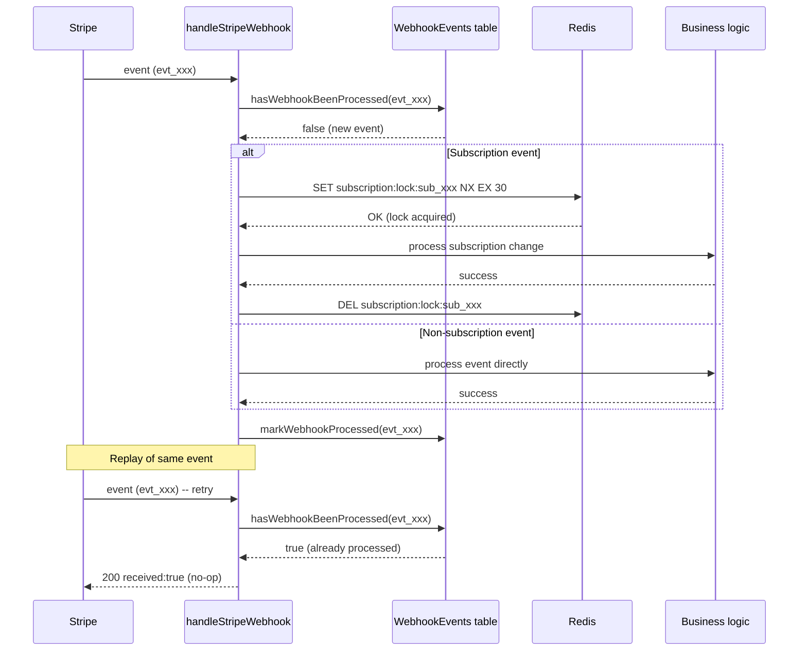
```mermaid
sequenceDiagram
  participant Stripe
  participant Webhook as handleStripeWebhook
  participant DB as WebhookEvents table
  participant Redis
  participant BizLogic as Business logic

  Stripe->>Webhook: event (evt_xxx)
  Webhook->>DB: hasWebhookBeenProcessed(evt_xxx)
  DB-->>Webhook: false (new event)

  alt Subscription event
    Webhook->>Redis: SET subscription:lock:sub_xxx NX EX 30
    Redis-->>Webhook: OK (lock acquired)
    Webhook->>BizLogic: process subscription change
    BizLogic-->>Webhook: success
    Webhook->>Redis: DEL subscription:lock:sub_xxx
  else Non-subscription event
    Webhook->>BizLogic: process event directly
    BizLogic-->>Webhook: success
  end

  Webhook->>DB: markWebhookProcessed(evt_xxx)

  Note over Stripe,Webhook: Replay of same event
  Stripe->>Webhook: event (evt_xxx) -- retry
  Webhook->>DB: hasWebhookBeenProcessed(evt_xxx)
  DB-->>Webhook: true (already processed)
  Webhook-->>Stripe: 200 received:true (no-op)
```

#### 13.4.3 Test blueprint -- Event-level idempotency

- **Scenario: duplicate event delivery is idempotent**
  - Precondition: `webhookEvent` table has entry for `evt_abc123`
  - Action: call `handleStripeWebhook` with event `{ id: 'evt_abc123', type: 'checkout.session.completed', ... }`
  - Assertions:
    - Returns `{ received: true }` immediately
    - `processCheckoutCompleted` is NOT called
    - `markWebhookProcessed` is NOT called again
    - `updateUserPlan` is NOT called

- **Scenario: first delivery processes and marks**
  - Precondition: `webhookEvent` table has no entry for `evt_new456`
  - Action: call `handleStripeWebhook` with `checkout.session.completed` event
  - Assertions:
    - `processCheckoutCompleted` IS called
    - `markWebhookProcessed('evt_new456')` IS called after success
    - User plan is updated

- **Scenario: partial failure does not mark as processed**
  - Precondition: no prior entry; `processCheckoutCompleted` throws mid-execution
  - Action: call `handleStripeWebhook`
  - Assertions:
    - `markWebhookProcessed` is NOT called (event can be retried)
    - Error is propagated or logged
    - Subsequent retry of same event processes successfully

- **Scenario: concurrent delivery of different events for same subscription**
  - Precondition: no prior entries
  - Action: call `handleStripeWebhook` with `evt_aaa` (`subscription.created`) and `evt_bbb` (`subscription.updated`) concurrently
  - Assertions:
    - Both events get unique `webhookEvent` entries
    - Each is processed independently (different `eventId`)
    - Both call `processSubscriptionEvent`

#### 13.4.4 Test blueprint -- Per-subscription locking

- **Scenario: lock acquired and released**
  - Precondition: Redis available; no existing lock
  - Action: call `processSubscriptionEvent` with `subscription.created` event
  - Assertions:
    - Redis SET called with `subscription:lock:sub_xxx`, `NX`, `EX 30`
    - Business logic executes
    - Redis DEL called with `subscription:lock:sub_xxx` in finally block

- **Scenario: lock contention skips processing**
  - Precondition: Redis has existing lock `subscription:lock:sub_xxx`
  - Action: call `processSubscriptionEvent` with another event for same subscription
  - Assertions:
    - Redis SET returns `null` (lock not acquired)
    - Business logic is NOT executed
    - Function returns without error
    - Log message indicates skipped processing

- **Scenario: Redis unavailable continues without lock**
  - Precondition: `getRedisClient()` returns `null`
  - Action: call `processSubscriptionEvent`
  - Assertions:
    - No Redis operations attempted
    - Business logic executes normally (degraded safety)
    - Warning logged about missing lock

- **Scenario: lock auto-expires after 30 seconds**
  - Precondition: lock set with `EX 30`
  - Action: wait 31 seconds (fake timers), then attempt to acquire lock
  - Assertions:
    - Lock acquisition succeeds (previous lock expired)
    - Business logic executes

- **Scenario: lock release failure is non-fatal**
  - Precondition: lock acquired; `redis.del()` throws
  - Assertions:
    - Business logic completes
    - Warning logged about release failure
    - No error propagated to caller

#### 13.4.5 Test blueprint -- Event ordering and interleaving

- **Scenario: checkout.session.completed before subscription.created**
  - Action: process `checkout.session.completed` (sets user plan), then `subscription.created` (applies subscription)
  - Assertions: user has correct plan; no duplicate plan assignment; entitlements computed once per event

- **Scenario: subscription.deleted before subscription.updated (out of order)**
  - Action: process `subscription.deleted` first (clears plan), then `subscription.updated` (would apply plan)
  - Assertions: after both events, user is on active plan (the `updated` event restores access since status check passes for `active` subscriptions)

- **Scenario: subscription.updated with quantity change triggers seat sync**
  - Precondition: org exists with 5 seats; webhook delivers `subscription.updated` with `previous_attributes.items.data[0].quantity = 5` and new quantity `10`
  - Assertions: `updateOrgSeatCount(orgId, 10)` called; org seat count updated to 10

- **Scenario: subscription.updated with quantity reduction below current usage**
  - Precondition: org has 8 members, 10 seats; webhook reduces to 5 seats
  - Assertions: `updateOrgSeatCount(orgId, 5)` called; `pendingRemoval` set on org; no members auto-removed

- **Scenario: subscription.updated missing org_id in metadata**
  - Precondition: subscription metadata has no `org_id`; DB has org with matching `stripeSubscriptionId`
  - Assertions: fallback DB lookup finds org; seat count update proceeds; warning logged about missing metadata

#### 13.4.6 Risks

- **Risk**: mocking Stripe event objects with incorrect shape leads to false-positive tests. **Mitigation**: use Stripe SDK type assertions and fixture factories that mirror real webhook payloads.
- **Risk**: timing-sensitive lock tests are flaky. **Mitigation**: use fake timers exclusively; never rely on real wall-clock time.

---

### 13.5 WS5 -- Org-Role and Entitlement Edge-Case Coverage

#### 13.5.1 Current test coverage

Existing org tests:

- `tests/unit/organization-owner-removal-guard.vitest.ts`: sole owner removal blocked; self-removal allowed when other members exist
- `tests/unit/organization-route-validation.vitest.ts`: invalid `orgId`, malformed JSON, invalid `newOwnerId`
- `tests/unit/stripe-entitlements-recompute-order.vitest.ts`: entitlement invalidation order on subscription deletion

Existing entitlement tests (`tests/entitlements.vitest.ts`):

- `computeEntitlements` for free/pro/business plans
- Override application (deep merge)
- Usage counters and `resetDailyUsageCounters`
- `reserveDeepResearchSlot` concurrency

#### 13.5.2 Permission model reference

Roles and their permissions (from `lib/organizations/permissions.ts`):

- **owner**: `org.view`, `org.edit`, `org.delete`, `members.view`, `members.invite`, `members.remove`, `members.edit_role`, `billing.view`, `billing.manage`, `resources.create`, `resources.delete`, `personas.create`, `personas.edit`, `personas.delete`
- **admin**: `org.view`, `org.edit`, `members.view`, `members.invite`, `members.remove`, `billing.view`, `resources.create`, `resources.delete`, `personas.create`, `personas.edit`, `personas.delete`
- **member**: `org.view`, `members.view`, `billing.view`, `resources.create`

Key differences:

- Only `owner` has `org.delete`, `members.edit_role`, `billing.manage`
- `admin` has `members.remove` but NOT `members.edit_role`
- `member` cannot invite, remove members, or manage billing

#### 13.5.3 Entitlement precedence model

Entitlement resolution flow (from `lib/entitlements/index.ts`):

1. Fetch user record with optional org join
2. Determine effective plan: if user has `orgId` and org has a plan, use `org.plan`; otherwise use `user.plan`
3. Compute base features from `BASE_FEATURES[effectivePlan]`
4. Extract org overrides from `org.limits` JSON field via `extractOrgOverrides`
5. Deep-merge overrides into base features
6. Cache result in Redis with key `entitlements:{userId}:{PLAN_VERSION}` for 10 minutes
7. Return `NormalizedEntitlements` with `features`, `plan_version`, `source`

Usage enforcement:

- `getAccessContext()` returns `AccessContext` with resolved entitlements and normalized usage counters
- Route handlers check `entitlements.features.chats_per_day` against `usageCounters.chats_today`
- `incrementUsageCounter` atomically updates the JSONB `usageCounters` field

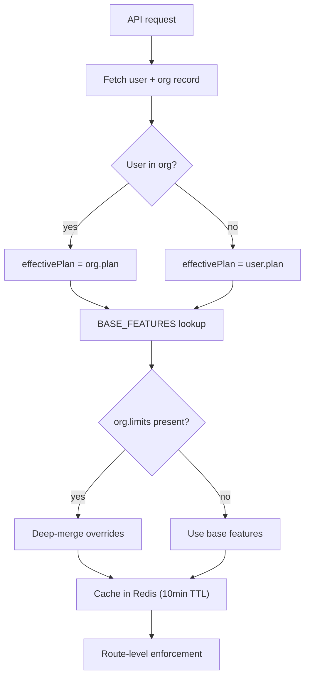
```mermaid
graph TD
  Req["API request"] --> Fetch["Fetch user + org record"]
  Fetch --> Plan{"User in org?"}
  Plan -->|yes| OrgPlan["effectivePlan = org.plan"]
  Plan -->|no| UserPlan["effectivePlan = user.plan"]
  OrgPlan --> Base["BASE_FEATURES lookup"]
  UserPlan --> Base
  Base --> Override{"org.limits present?"}
  Override -->|yes| Merge["Deep-merge overrides"]
  Override -->|no| NoMerge["Use base features"]
  Merge --> Cache["Cache in Redis (10min TTL)"]
  NoMerge --> Cache
  Cache --> Enforce["Route-level enforcement"]
```

#### 13.5.4 Test blueprint -- Org permission edge cases

- **Scenario: admin cannot manage billing**
  - Precondition: user has role `admin` in org
  - Action: `checkOrgPermission(userId, orgId, 'billing.manage')`
  - Assertions: returns `false` (admin has `billing.view` only, not `billing.manage`)

- **Scenario: admin can remove members but not edit roles**
  - Precondition: user has role `admin`
  - Action: `checkOrgPermission(userId, orgId, 'members.remove')` and `checkOrgPermission(userId, orgId, 'members.edit_role')`
  - Assertions: remove returns `true`; edit_role returns `false`

- **Scenario: admin cannot remove owner**
  - Precondition: admin attempts to remove a user with role `owner`
  - Action: `canManageUser(adminId, targetOwnerId, orgId)`
  - Assertions: returns `false` (only owners can manage other owners)

- **Scenario: sole owner cannot be removed**
  - Precondition: org has exactly one owner
  - Action: attempt to remove the owner
  - Assertions: operation blocked with specific error about sole owner

- **Scenario: owner can transfer ownership (edit_role)**
  - Precondition: owner changes another member's role to `owner`
  - Action: role change operation
  - Assertions: new member is `owner`; original owner retains their role (does not auto-demote)

- **Scenario: member cannot invite**
  - Action: `checkOrgPermission(memberId, orgId, 'members.invite')`
  - Assertions: returns `false`

- **Scenario: getUserOrgRole with legacy data (user has orgId but no OrgMemberRole)**
  - Precondition: user record has `orgId` set; no entry in `orgMemberRole` table
  - Action: `getUserOrgRole(userId, orgId)`
  - Assertions: returns appropriate fallback role or null (depends on implementation)

- **Scenario: canAccessPersona for org-shared persona**
  - Precondition: persona has `visibility: 'org'` and `orgId`; user is member of that org
  - Action: `canAccessPersona(userId, persona)`
  - Assertions: `canChat: true`, `canViewSettings: false`, `canEdit: false` (member cannot edit)

- **Scenario: canAccessPersona for org-shared persona as admin**
  - Precondition: same persona; user is admin of org
  - Action: `canAccessPersona(userId, persona)`
  - Assertions: `canChat: true`, `canViewSettings: true`, `canEdit: true`

#### 13.5.5 Test blueprint -- Seat enforcement edge cases

- **Scenario: join at exact capacity**
  - Precondition: org has `seatCount = 5` and 5 current members
  - Action: `hasAvailableSeats(orgId)`
  - Assertions: returns `false`; `enforceSeatLimit(orgId)` throws

- **Scenario: join below capacity**
  - Precondition: org has `seatCount = 5` and 3 members
  - Action: `hasAvailableSeats(orgId)` and `enforceSeatLimit(orgId)`
  - Assertions: `hasAvailableSeats` returns `true`; `enforceSeatLimit` does not throw

- **Scenario: seat reduction below usage sets pendingRemoval**
  - Precondition: org has 8 members, 10 seats
  - Action: `updateOrgSeatCount(orgId, 5)`
  - Assertions: `org.seatCount` updated to 5; `org.pendingRemoval` is set (or equivalent flag); no members auto-removed

- **Scenario: invalid seat count is clamped**
  - Action: `updateOrgSeatCount(orgId, -5)` / `updateOrgSeatCount(orgId, 20000)` / `updateOrgSeatCount(orgId, NaN)`
  - Assertions: seat count clamped to 1-10000 range; error logged

- **Scenario: concurrent join race at capacity**
  - Precondition: org has 4 of 5 seats used; two users attempt to join simultaneously
  - Assertions: at most one succeeds; the other receives seat limit error

#### 13.5.6 Test blueprint -- Entitlement edge cases

- **Scenario: org plan overrides user plan**
  - Precondition: user has `plan = 'free'`; user's org has `plan = 'business'`
  - Action: `getAccessContext(userId)`
  - Assertions: returned entitlements match `business` plan features, not `free`

- **Scenario: user leaves org mid-session**
  - Precondition: user was in org with `business` plan; `orgId` removed
  - Action: `getAccessContext(userId)` after org removal
  - Assertions: entitlements revert to user's own plan (`free`); cached entitlements invalidated

- **Scenario: org.limits overrides specific features**
  - Precondition: org has `plan = 'business'` and `limits = { features: { chats_per_day: 500 } }`
  - Action: `computeEntitlements('business', extractOrgOverrides(org))`
  - Assertions: `features.chats_per_day === 500` (overridden from default 1000)

- **Scenario: usage counter at daily limit blocks chat**
  - Precondition: user on `free` plan (`chats_per_day: 20`); `usageCounters.chats_today === 20`
  - Action: attempt to send chat message
  - Assertions: rejected with entitlement error indicating daily limit reached

- **Scenario: incrementUsageCounter atomically updates JSONB**
  - Precondition: `usageCounters.chats_today === 5`
  - Action: `incrementUsageCounter(userId, 'chats_today', 1)`
  - Assertions: `usageCounters.chats_today === 6`; concurrent increments do not lose updates

- **Scenario: reserveDeepResearchSlot token bucket**
  - Precondition: Redis available; no active slots
  - Action: reserve 3 slots in quick succession
  - Assertions: first two succeed (within bucket capacity); third may be rate-limited depending on refill timing

- **Scenario: reserveDeepResearchSlot with Redis unavailable**
  - Precondition: `getRedisClient()` returns null
  - Action: `reserveDeepResearchSlot(userId)`
  - Assertions: falls back to in-memory bucket; reservation succeeds

- **Scenario: entitlement cache invalidation on plan change**
  - Precondition: cached entitlements for user at `PLAN_VERSION`
  - Action: upgrade user plan via webhook; call `recomputeUserEntitlements`
  - Assertions: Redis cache key deleted; next `getAccessContext` returns updated entitlements

#### 13.5.7 Risks

- **Risk**: permission tests that mock the DB miss schema-level constraints. **Mitigation**: include at least one integration test per permission path that uses a test database.
- **Risk**: entitlement cache TTL (10 minutes) can serve stale data after plan change. **Mitigation**: `recomputeUserEntitlements` explicitly deletes the cache key; test that deletion occurs before recompute.

---

### 13.6 WS6 -- RAG Namespace Ownership and Source Map

#### 13.6.1 Purpose

This section defines the canonical reference for all RAG namespaces, their storage backends, ownership boundaries, read/write paths, and runtime precedence rules. It serves as the architecture-level source map that all other workstreams reference.

#### 13.6.2 Namespace inventory

**Upstash Vector namespaces** (all share the same Upstash index via `UPSTASH_USER_RAG_REST_URL`):

- **User knowledge**: namespace = `{userId}`
  - Owner: individual user
  - Write path: `processUserDocument(userId, ...)` in `lib/ai/user-rag.ts`
  - Read path: `findRelevantUserContent(userId, query)` in `lib/ai/user-rag.ts`
  - Source of truth: `userDocuments` + `document` tables (file metadata); Upstash (embeddings)

- **Org knowledge**: namespace = `org:{orgId}`
  - Owner: organization
  - Write path: `processOrgDocument(orgId, ...)` -> delegates to `processUserDocument('org:' + orgId, ...)` in `lib/ai/org-rag.ts`
  - Read path: `findRelevantOrgContent(orgId, query)` -> delegates to `findRelevantUserContent('org:' + orgId, query)` in `lib/ai/org-rag.ts`
  - Source of truth: `orgDocument` table (file metadata); Upstash (embeddings)

- **Persona base knowledge**: namespace = `{personaId}`
  - Owner: persona creator (user or system)
  - Write path: `processPersonaDocuments(personaId, ...)` -> `processUserDocument(personaId, ...)` in `lib/ai/persona-rag.ts`
  - Read path: `personaRagContextPrompt(personaId, ...)` -> `findRelevantUserContent(personaId, ...)` in `lib/ai/persona-rag.ts`
  - Source of truth: `personaDocument` + `personaComposerDocument` tables; Upstash (embeddings)

- **Persona overlay knowledge**: namespace = `overlay:{personaId}:{userId}`
  - Owner: individual user (their customizations on a persona)
  - Write path: `processPersonaOverlayDocuments(...)` -> `processUserDocument('overlay:' + personaId + ':' + userId, ...)` in `lib/ai/persona-rag.ts`
  - Read path: `personaRagContextPrompt(...)` -> `findRelevantUserContent('overlay:' + personaId + ':' + userId, ...)` in `lib/ai/persona-rag.ts`
  - Source of truth: `personaUserOverlay` + `personaUserOverlayDocument` tables; Upstash (embeddings)

- **EOS Implementer profiles**: namespace = `eos-implementer-{profile-slug}`
  - Owner: system (hardcoded)
  - Profile-to-namespace map:
    - `quarterly-session-facilitator` -> `eos-implementer-quarterly-session`
    - `focus-day-facilitator` -> `eos-implementer-focus-day`
    - `vision-building-day-1` -> `eos-implementer-vision-day-1`
    - `vision-building-day-2` -> `eos-implementer-vision-day-2`
  - Write path: `addUpstashSystemContent(...)`, `processUpstashSystemDocument(...)`, upload scripts in `lib/ai/upstash-system-rag.ts`
  - Read path: `upstashSystemRagContextPrompt(profileId, query)` in `lib/ai/upstash-system-rag.ts`
  - Cache: in-memory, 5-minute TTL, max 100 entries
  - Source of truth: Upstash (embeddings); no relational metadata table

- **Circle course knowledge**: namespace = `circle-course-{courseId}`
  - Owner: system (synced from Circle)
  - Write path: sync scripts (e.g., `sync-circle-course-to-upstash.ts`)
  - Read path: `getCircleCourseContext(namespace, query)` in `lib/ai/persona-rag.ts`
  - Source of truth: Upstash (embeddings); `circleCoursePersona` table (persona config)

**PostgreSQL pgvector tables**:

- **System persona/profile knowledge**: table = `systemEmbeddings`, namespace column = `{knowledgeNamespace}`
  - Owner: system persona or profile
  - Write path: `processSystemDocument(namespace, ...)`, `addSystemContent(namespace, ...)` in `lib/ai/system-rag.ts`
  - Read path: `findSystemContent(namespace, query)`, `findHierarchicalSystemContent(namespaces, query)` in `lib/ai/system-rag.ts`
  - Hierarchical search: queries multiple namespaces in priority order (profile namespace first, then persona namespace)
  - Source of truth: `systemEmbeddings` table (embeddings + content); persona/profile `knowledgeNamespace` fields

- **User memory embeddings**: table = `userMemoryEmbedding`
  - Owner: individual user
  - Write path: memory creation triggers embedding generation in `lib/ai/memory-rag.ts`
  - Read path: `findRelevantMemories(userId, query)`, `getRecentMemories(userId)` in `lib/ai/memory-rag.ts`
  - Scoring: 70% similarity + 20% confidence + 10% recency boost
  - Source of truth: `userMemory` table (memory content); `userMemoryEmbedding` table (embeddings)

**General embeddings** (Upstash via `UPSTASH_VECTOR_REST_URL` -- separate index from user RAG):

- **Company/general knowledge base**: default namespace
  - Write path: `lib/ai/embeddings.ts` via `addDocuments`
  - Read path: `findRelevantContent(query)` in `lib/ai/embeddings.ts`
  - Used for: company-wide context injected into all chats

#### 13.6.3 Namespace storage layout

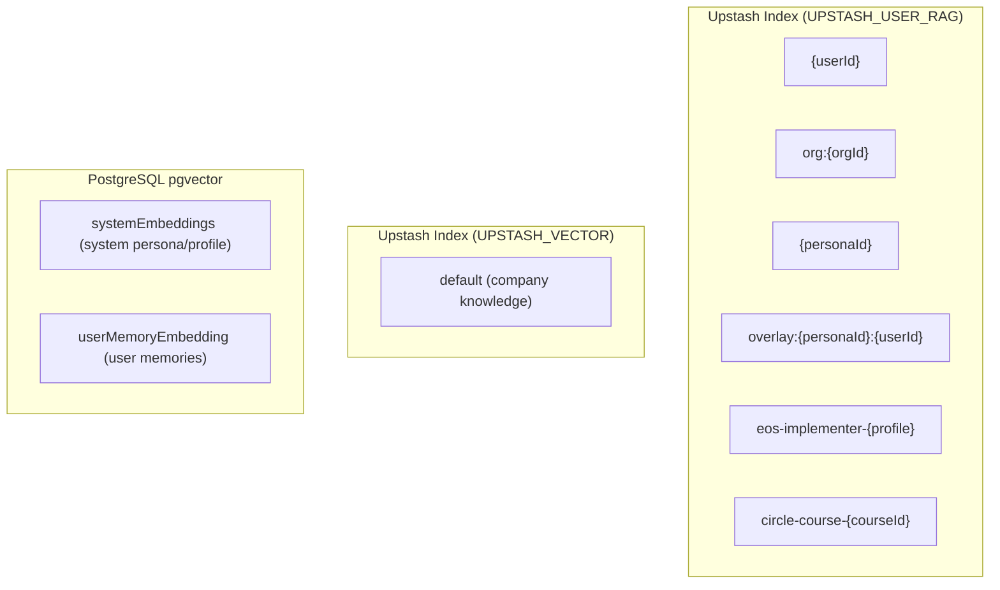
```mermaid
graph TD
  subgraph upstashUserRag ["Upstash Index (UPSTASH_USER_RAG)"]
    NS_USER["{userId}"]
    NS_ORG["org:{orgId}"]
    NS_PERSONA["{personaId}"]
    NS_OVERLAY["overlay:{personaId}:{userId}"]
    NS_EOS["eos-implementer-{profile}"]
    NS_CIRCLE["circle-course-{courseId}"]
  end

  subgraph upstashGeneral ["Upstash Index (UPSTASH_VECTOR)"]
    NS_COMPANY["default (company knowledge)"]
  end

  subgraph postgres ["PostgreSQL pgvector"]
    TBL_SYS["systemEmbeddings (system persona/profile)"]
    TBL_MEM["userMemoryEmbedding (user memories)"]
  end
```

#### 13.6.4 Runtime context retrieval precedence

When the chat route assembles context for a request, it retrieves from multiple namespaces in parallel. The final prompt includes contexts in the following priority order (from `lib/ai/context-assembler.ts`):

1. **System** (priority 1): system-persona or EOS-implementer context
2. **Memory** (priority 2): user memories (semantic + recency blend)
3. **Persona** (priority 3): base persona docs + overlay docs + overlay instructions
4. **Conversation summary** (priority 4): compressed history of the current chat
5. **User docs** (priority 5): user-uploaded knowledge base
6. **Org docs** (priority 6): organization-shared knowledge base
7. **Company context** (priority 7): platform-wide general knowledge

If a higher-priority source exceeds the token budget, `compressContext(...)` is attempted. If compression is insufficient, lower-priority sources are dropped entirely.

#### 13.6.5 Environment variable to index mapping

- `UPSTASH_USER_RAG_REST_URL` / `UPSTASH_USER_RAG_REST_TOKEN`: used by user, org, persona, overlay, EOS implementer, and circle-course namespaces (all share one index, differentiated by namespace)
- `UPSTASH_VECTOR_REST_URL` / `UPSTASH_VECTOR_REST_TOKEN`: used by the company/general knowledge base (`lib/ai/embeddings.ts`)
- PostgreSQL (`POSTGRES_URL`): used by `systemEmbeddings` and `userMemoryEmbedding` tables via Drizzle ORM

#### 13.6.6 Embedding model

All paths use `openai.embedding('text-embedding-ada-002')` producing 1536-dimension vectors. This is consistent across Upstash and Postgres storage. Changing the embedding model requires re-indexing all namespaces.

#### 13.6.7 Chunking parameters

Default chunking (`generateChunks` in `lib/ai/user-rag.ts`):

- Chunk size: 1000 characters
- Overlap: 200 characters
- Method: sentence-boundary splitting

These parameters apply to user, org, persona, overlay, and system document ingestion. EOS Implementer and circle-course content may use custom upload scripts with different chunking.

#### 13.6.8 Fallback behavior

Current fallback policy:

- If Upstash is unavailable for user/org/persona retrieval: empty context returned, no error thrown
- If Upstash is unavailable for EOS Implementer: empty context returned, no Postgres fallback
- If Postgres is unavailable for system RAG: error propagated (caught by caller, results in empty context)
- If Postgres is unavailable for memory RAG: error propagated (caught by caller, results in empty memory context)

There is no cross-backend fallback (Upstash does not fall back to Postgres or vice versa). Each backend failure results in that context source being silently omitted from the prompt.

#### 13.6.9 Recommended formalization actions

1. Create a `lib/ai/rag-namespace-registry.ts` module that exports the canonical namespace patterns, ownership rules, and backend assignments as typed constants.
2. Ensure `resolveSystemRagBackend` (from WS2) uses this registry instead of inline string matching.
3. Add a health-check endpoint that verifies connectivity to both Upstash indexes and PostgreSQL pgvector, confirming that all namespace backends are reachable.
4. Document the namespace registry in this spec and keep it synchronized with code changes via a CI lint rule that checks the registry against actual usage.

---

### 13.7 Cross-Workstream Acceptance Criteria

All six workstreams are considered complete when:

- Every extracted service (WS1) has a passing contract test suite with the scenarios documented in section 13.1.3.
- `resolveSystemRagBackend` (WS2) passes all scenarios in section 13.2.5 and is called from both the chat route and the context assembler.
- Stream recovery (WS3) passes all API-layer, unit, and hook scenarios documented in sections 13.3.4 through 13.3.7.
- Webhook replay (WS4) passes all idempotency, locking, and ordering scenarios documented in sections 13.4.3 through 13.4.5.
- Org and entitlement tests (WS5) pass all permission, seat, and entitlement scenarios documented in sections 13.5.4 through 13.5.6.
- The RAG namespace source map (WS6) is codified in `lib/ai/rag-namespace-registry.ts` and referenced by this specification.
- All existing E2E tests (`tests/e2e/*`, `tests/routes/*`) continue to pass after each workstream lands.
- No new Sentry errors appear in production after each workstream deployment.

## 14. Additional Platform Architecture Coverage

This section closes the remaining architecture coverage gaps for major systems that were previously only referenced indirectly. It focuses on runtime behavior, component boundaries, state and data flow, and operational constraints.

### 14.1 Composer Rendering and Document Generation System

Primary files:

- `lib/composer/server.ts`
- `components/composer.tsx`
- `components/create-composer.tsx`
- `components/data-stream-handler.tsx`
- `composer/*/server.ts`
- `composer/*/client.tsx`
- `lib/ai/tools/create-document.ts`
- `lib/ai/tools/update-document.ts`
- `lib/ai/tools/request-suggestions.ts`
- `app/(chat)/api/composer/edit/route.ts`

#### 14.1.1 Core architecture

The composer system is a multi-kind document pipeline with a strict server/client split:

- **Server-side handlers** are registered in `documentHandlersByComposerKind` (`lib/composer/server.ts`).
- **Client-side behavior** is registered in `composerDefinitions` (`components/composer.tsx`).
- Each kind (`text`, `code`, `image`, `sheet`, `chart`, `vto`, `accountability`) has:
  - a server handler in `composer/<kind>/server.ts`
  - a client implementation in `composer/<kind>/client.tsx`

`createDocumentHandler(...)` in `lib/composer/server.ts` is the core abstraction that standardizes:

- streamed generation (`onCreateDocument` and `onUpdateDocument`)
- incremental Redis buffering with `ComposerContentBuffer`
- persistence via `saveDocument(...)` after stream completion
- cleanup of partial content buffers on completion

#### 14.1.2 Streaming and partial recovery behavior

During streaming create/update operations:

- delta chunks are intercepted by a wrapped `dataStream.write(...)`
- content is accumulated and checkpointed every `INCREMENTAL_SAVE_INTERVAL = 500ms`
- checkpoints are written to `composer:stream:{documentId}:content` (TTL 1800s) through `ComposerContentBuffer`

Recovery touchpoints:

- `recoverPartialContent(documentId)` in `lib/composer/server.ts` reads partial Redis content
- chat stream GET recovery can include partial composer content for client restoration
- `DataStreamHandler` buffers content deltas until `kind` metadata is known, then replays buffered deltas through `composerDefinition.onStreamPart(...)`

#### 14.1.3 Edit flow and persistence touchpoints

- AI-triggered edit path:
  - tool call enters `updateDocument(...)`
  - target document is loaded
  - kind-specific handler is resolved from `documentHandlersByComposerKind`
  - streamed edit deltas are emitted to client
  - final content is persisted to DB

- User/API edit path:
  - `POST app/(chat)/api/composer/edit/route.ts`
  - mode `create` or `update`
  - same handler registry and kind contract

Persistence paths:

- `saveDocument(...)` for stream-final content writes
- version-aware operations in document APIs (`app/(chat)/api/document/route.ts`, `lib/db/document-service.ts`)
- client autosave mechanisms for direct editor interactions

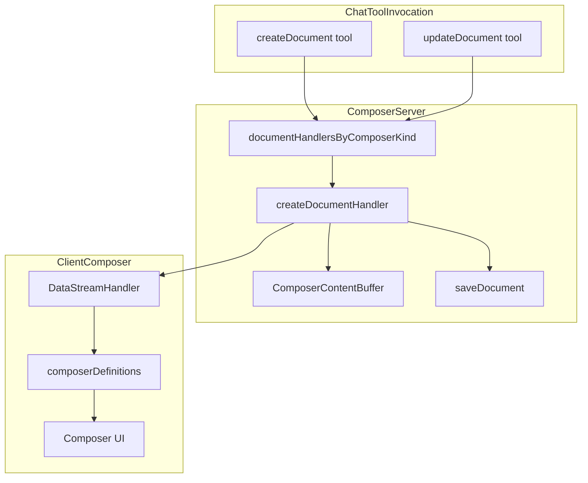
```mermaid
flowchart TD
  subgraph chatTool [ChatToolInvocation]
    createTool[createDocument tool]
    updateTool[updateDocument tool]
  end

  subgraph serverComposer [ComposerServer]
    registry[documentHandlersByComposerKind]
    handlerFactory[createDocumentHandler]
    buffer[ComposerContentBuffer]
    saveDoc[saveDocument]
  end

  subgraph clientComposer [ClientComposer]
    streamHandler[DataStreamHandler]
    defs[composerDefinitions]
    composerUi[Composer UI]
  end

  createTool --> registry
  updateTool --> registry
  registry --> handlerFactory
  handlerFactory --> buffer
  handlerFactory --> saveDoc
  handlerFactory --> streamHandler
  streamHandler --> defs
  defs --> composerUi
```

### 14.2 AI Tooling Architecture and Execution Model

Primary files:

- `lib/ai/tools.ts`
- `lib/ai/tools/*.ts`
- `app/api/chat/route.ts`

#### 14.2.1 Tool definition model

The platform uses Vercel AI SDK tool definitions (`tool(...)`) with explicit Zod schemas and two lifecycle modes:

- **request-scoped tools** built per chat request with session/data-stream context:
  - `createDocument(...)`
  - `updateDocument(...)`
  - `requestSuggestions(...)`

- **shared tools** imported and executed directly:
  - `searchWeb`
  - `getWeather`
  - RAG helpers (`addResource`, `getInformation`)
  - calendar tools (`getCalendarEvents`, `createCalendarEvent`, conflict/availability helpers)

#### 14.2.2 Chat-route wiring and activation

In `app/api/chat/route.ts`, tools are assembled into `streamText({ tools, ... })` with:

- explicit active tool sets (`experimental_activeTools`)
- preflight-driven `toolChoice` overrides (for forced first-step behaviors such as document creation)
- environment and account gating:
  - calendar tools depend on connected calendar state and token availability
  - destructive dev-only tools remain environment-gated

Tool outputs are emitted through data parts and consumed by client stream handlers.

#### 14.2.3 Tool domain map

- **Document/composer domain**: create, update, suggestion tools
- **Web/external domain**: search and weather
- **Knowledge domain**: add resource and retrieval tools
- **Calendar domain**: event operations, conflict/availability intelligence

```mermaid
flowchart LR
  stream[streamText]
  stream --> docsTools[Document Tools]
  stream --> webTools[Web Tools]
  stream --> ragTools[RAG Tools]
  stream --> calTools[Calendar Tools]

  docsTools --> composer[Composer subsystem]
  webTools --> internet[External web/data]
  ragTools --> ragLayer[RAG services]
  calTools --> gcal[Google Calendar APIs]
```

### 14.3 Deep Research (Nexus) Orchestration

Primary files:

- `lib/ai/deep-research/orchestrator.ts`
- `lib/ai/deep-research/search-executor.ts`
- `lib/ai/deep-research/prompts.ts`
- `lib/ai/deep-research/types.ts`
- `app/api/chat/deep-research/route.ts`

#### 14.3.1 Entry points and execution modes

Nexus research mode is accessible through:

- branch execution in `app/api/chat/route.ts` when `selectedResearchMode === 'nexus'`
- dedicated endpoint `app/api/chat/deep-research/route.ts`

Both paths execute `runDeepResearch(...)` and stream status/progress back to the UI.

#### 14.3.2 Orchestration phases

`runDeepResearch(...)` executes a multi-phase workflow:

1. plan generation
2. bulk parallel search
3. analysis and gap detection
4. follow-up search iterations
5. synthesis with citations

Search execution is handled by `search-executor.ts` with bounded concurrency and quality scoring/reindexing of sources before synthesis.

#### 14.3.3 Writer protocol and UI events

The orchestrator emits structured writer events:

- progress updates
- text chunks
- citation payloads
- completion summaries
- error events

Route adapters convert these into UI stream-compatible data parts used by frontend progress views.

```mermaid
flowchart TD
  start[runDeepResearch]
  start --> phase1[Phase1 Planning]
  phase1 --> phase2[Phase2 BulkSearch]
  phase2 --> phase3[Phase3 Analysis]
  phase3 --> phase4[Phase4 FollowUpSearch]
  phase4 --> phase5[Phase5 Synthesis]

  phase2 --> searchExec[executeSearchBatch]
  phase4 --> searchExec
  phase5 --> writer[DeepResearchWriter]
  writer --> ui[UI progress and citations]
```

### 14.4 Voice and ASR Architecture

Primary files:

- `lib/voice/config.ts`
- `app/api/voice/session/route.ts`
- `app/api/voice/recordings/route.ts`
- `app/api/voice/recordings/transcribe/route.ts`
- `app/api/voice/recordings/analyze/route.ts`
- `app/api/voice/recordings/send-to-chat/route.ts`
- `app/api/voice/batch-save/route.ts`

#### 14.4.1 Realtime voice sessions

Realtime voice mode uses OpenAI Realtime session setup:

- client requests ephemeral session credentials from `/api/voice/session`
- server builds contextual voice instructions (persona/profile-aware)
- client connects via WebRTC to realtime endpoints

Configuration in `lib/voice/config.ts` governs:

- model selection
- audio input/output formats
- voice profile
- server VAD behavior

#### 14.4.2 Recording and transcription lifecycle

Recording lifecycle includes:

- upload and metadata write (`voiceRecording`)
- async/background transcription with Whisper
- transcript persistence (`voiceTranscript`)
- optional RAG ingestion from transcript content
- optional analysis route (including speaker segmentation paths)
- send-to-chat route that materializes chat/message history from recording content

#### 14.4.3 Limits and degradation behavior

Voice and transcription routes enforce plan/usage gates via entitlements and usage counters.

Degradation behaviors:

- missing optional diarization dependency falls back to simpler speaker segmentation
- transcription/indexing failure can preserve base recording metadata while marking downstream status failures

```mermaid
flowchart TD
  client[Client Voice UI] --> sessionApi[/api/voice/session]
  sessionApi --> realtime[OpenAI Realtime]

  client --> uploadApi[/api/voice/recordings]
  uploadApi --> blob[Vercel Blob]
  uploadApi --> recDb[(voiceRecording)]
  uploadApi --> transcribe[/api/voice/recordings/transcribe]
  transcribe --> whisper[Whisper transcription]
  whisper --> transcriptDb[(voiceTranscript)]
  transcribe --> userRag[User RAG indexing]
  client --> analyze[/api/voice/recordings/analyze]
  client --> sendToChat[/api/voice/recordings/send-to-chat]
  sendToChat --> chatDb[(Chat and Message_v2)]
```

### 14.5 Public API and API Key Platform

Primary files:

- `app/api/v1/*`
- `lib/api/middleware.ts`
- `lib/api/keys.ts`
- `app/api/api-keys/route.ts`
- `app/api/check-api-key/route.ts`

#### 14.5.1 API surface

The public platform API under `/api/v1` includes:

- chat completion route
- model listing route
- usage/stats route
- embeddings route
- conversation CRUD routes
- document analyze route

The surface is OpenAI-style in request/response framing while preserving EOS-specific model and persona behavior.

#### 14.5.2 API key lifecycle and middleware

`lib/api/middleware.ts` and `lib/api/keys.ts` provide:

- key extraction (`Authorization` bearer or `X-API-Key`)
- key validation (active/expiry/metadata checks)
- scope enforcement per endpoint
- model allowlist enforcement
- per-key rate limiting (minute/day windows)
- rate limit response headers
- usage logging and endpoint-level telemetry

Keys are stored as hashes, never as plaintext in persistence.

#### 14.5.3 Operational invariants

- every request is validated before route logic executes
- `429` responses include retry/rate-limit metadata
- usage counters and per-endpoint stats are logged for successful and failure paths
- CORS and preflight behavior is handled for browser clients

### 14.6 File Upload and Document Processing Pipeline

Primary files:

- `app/api/documents/upload/route.ts`
- `app/api/documents/bulk-upload/route.ts`
- `app/api/documents/check-duplicate/route.ts`
- `lib/utils/file-hash.ts`
- `lib/storage/tracking.ts`
- `lib/ai/user-rag.ts`

#### 14.6.1 Ingestion and extraction

Upload routes support multiple extraction strategies by content type:

- text/markdown direct parsing
- PDF extraction with fallback strategies
- office-format extraction (spreadsheet/document/presentation handlers)
- image or multimodal analysis paths where applicable

#### 14.6.2 Storage quota and blob orchestration

Storage behavior is explicit and transactional:

- `reserveStorageAtomic(...)` before upload write
- blob upload to Vercel Blob
- DB metadata write
- `releaseStorageReservation(...)` on failure paths
- final storage usage update

#### 14.6.3 Dedupe, versioning, and async RAG indexing

Document dedupe uses content hashing (`computeStringHash(...)`) and can route duplicates into versioned document records rather than full duplication.

RAG indexing handoff:

- upload record enters `pending`/`processing`
- async `processUserDocument(...)` performs chunking and embedding
- status transitions to `ready` or `failed` with error detail

Key chunking defaults in `lib/ai/user-rag.ts`:

- chunk size: 1000 chars
- overlap: 200 chars

### 14.7 Calendar Integration Architecture

Primary files:

- `lib/integrations/calendar/connect.ts`
- `lib/integrations/calendar/oauth-state.ts`
- `app/api/calendar/auth/route.ts`
- `app/api/calendar/auth/callback/route.ts`
- `app/api/calendar/events/route.ts`
- `app/api/calendar/disconnect/route.ts`
- `app/api/calendar/status/route.ts`
- `lib/ai/tools/calendar-tools.ts`
- `lib/ai/tools.ts`

#### 14.7.1 OAuth and token persistence

Calendar connection flow:

1. auth initiation route generates OAuth request
2. signed state payload is generated and validated (`oauth-state.ts`)
3. callback exchanges code for tokens
4. tokens are upserted in `googleCalendarToken`
5. user calendar-connected flags are synchronized

#### 14.7.2 Event APIs and tool integration

Calendar route layer exposes list/create behavior.
AI tools can consume calendar capabilities when a valid token is present and plan entitlements allow access.

Blocked flows (missing entitlement or missing connection) are tracked as analytics events.

### 14.8 Circle Course Integration and Course Persona Sync

Primary files:

- `lib/integrations/circle.ts`
- `scripts/sync-circle-course-to-upstash.ts`
- `app/api/circle/sync-course/route.ts`
- `app/api/circle/activate-course/route.ts`
- `app/api/circle/activate-course-system/route.ts`
- `lib/ai/persona-rag.ts`
- `lib/db/schema.ts` (`circleCoursePersona`)

#### 14.8.1 Course sync and namespace model

Course content is transformed into vectorized knowledge under shared namespaces:

- namespace convention: `circle-course-{courseId}`
- sync paths: script-based and API-based
- sync metadata persisted in `circleCoursePersona` (status/lastSynced)

#### 14.8.2 Persona activation and retrieval integration

Activation routes create or map personas to Circle course namespaces.
At retrieval time, persona RAG detects Circle namespace patterns and switches to course-context retrieval path using Upstash-backed search.

This enables one course namespace to support many users without duplicating corpus storage.

### 14.9 Memory Lifecycle Beyond Retrieval

Primary files:

- `lib/ai/memory-extractor.ts`
- `lib/ai/memory.ts`
- `lib/ai/background-summary.ts`
- `app/api/chat/route.ts`

#### 14.9.1 Post-response memory extraction

After assistant output persistence in chat flow:

- `extractAndSaveMemories(...)` evaluates user/assistant turns
- structured memory candidates are extracted
- candidates are embedded and deduplicated against existing memory embeddings
- non-duplicate memories are persisted with embeddings

#### 14.9.2 Similarity-based dedupe and confidence updates

Memory dedupe uses embedding similarity thresholds and can:

- skip near-duplicate inserts
- boost confidence on reinforcing memories
- insert new memory records with chunked embeddings

This makes memory evolution incremental rather than append-only.

#### 14.9.3 Background summary lifecycle

`triggerBackgroundSummary(chatId)` manages deferred conversation summaries with guardrails:

- minimum-content checks
- stale-window checks (avoid excessive regeneration)
- single-chat in-progress guards

Summaries update chat-level fields used in downstream context assembly.

### 14.10 Frontend Client Architecture

Primary files:

- `components/chat.tsx`
- `components/data-stream-handler.tsx`
- `hooks/use-stream-recovery.ts`
- `hooks/use-composer.ts`
- `lib/stores/account-store.ts`
- `lib/stores/saved-content-store.ts`
- `lib/stores/upgrade-store.ts`
- `lib/stores/use-settings.ts`
- `app/layout.tsx`
- `app/(chat)/layout.tsx`

#### 14.10.1 State management model

Client state is layered:

- **Zustand stores** for durable app-level state:
  - account/entitlements/usage
  - upgrade modal and gated retry behavior
  - saved content (pins/bookmarks) with optimistic updates
  - local user settings toggles

- **SWR caches** for resource-oriented state:
  - composer document state and metadata
  - route-level cache primitives

- **React provider stack** for contextual concerns:
  - session/theme/settings
  - account/features/sidebar/loading

#### 14.10.2 Streaming client data flow

Chat streaming path:

1. UI submits input via multimodal input surfaces
2. `DefaultChatTransport` sends normalized request body
3. `useChat` receives stream parts
4. `chat.tsx` `onData` handles global metadata and control events
5. `DataStreamHandler` processes content-delta streams into composer state
6. `useStreamRecovery` restores active streams and final state on reload

Custom events coordinate cross-component updates (`messageActionUpdate`, mode-clear events, upgrade modal signals, account refresh signals).

```mermaid
flowchart TD
  input[MultimodalInput] --> chat[components/chat.tsx]
  chat --> transport[DefaultChatTransport]
  transport --> api[/api/chat]
  api --> stream[useChat stream]
  stream --> onData[onData handler]
  stream --> dataHandler[DataStreamHandler]
  onData --> composerState[useComposer state]
  dataHandler --> composerDefs[composerDefinitions]
  composerDefs --> composerState
  recovery[useStreamRecovery] --> api
  recovery --> stream
```

#### 14.10.3 Animation and rendering architecture

The client UI uses multiple animation systems:

- GSAP/ScrollTrigger for heavy scroll-driven motion (especially marketing/landing and advanced visual components)
- Framer Motion/Motion for transitions, list movement, modal animations, and interaction-level polish

This split enables high-performance narrative motion on marketing surfaces without coupling it to chat runtime logic.

### 14.11 Analytics and Event Tracking Architecture

Primary files:

- `lib/analytics/index.ts`
- `lib/analytics/client.ts`
- `app/api/analytics/events/route.ts`
- `lib/db/schema.ts` (`analyticsEvent`)
- `app/api/documents/analytics/route.ts`

#### 14.11.1 Event ingestion model

Two event paths:

- **client events**: frontend -> `/api/analytics/events` -> server recorder
- **server events**: direct `trackServerEvent(...)` and helper wrappers in business routes

Core helpers:

- `trackClientEvent(...)`
- `trackServerEvent(...)`
- `trackBlockedAction(...)`
- specialized business helpers (subscription/entitlement transitions)

#### 14.11.2 Tracked domains

Key tracked surfaces include:

- gating and upgrade funnel interactions
- blocked feature attempts (entitlement enforcement)
- billing/plan transitions
- org admin lifecycle events
- document usage analytics through context usage logs

Client helper prefers `sendBeacon` where possible for unload-safe event delivery, with fetch fallback.

### 14.12 Marketing and Landing Architecture

Primary files:

- `app/landing-page-client.tsx`
- `components/marketing/*`
- `components/marketing/lazy-marketing.tsx`

#### 14.12.1 Composition model

The marketing system is section-based and compositional:

- hero
- social proof
- feature sections
- product showcase
- FAQ
- CTA
- dedicated navbar/footer

#### 14.12.2 Performance and animation strategy

Heavy animated or visual components are lazy loaded through `lazy-marketing.tsx` to reduce first-load overhead.
GSAP-based scroll orchestration is used for story-driven movement and reveal sequencing, while lighter interaction transitions use motion-based components.

### 14.13 Coverage Status After Expansion

With sections 1 through 14, the specification now covers all major production architecture domains currently present in the repository:

- core chat orchestration and streaming
- full RAG surfaces and namespace ownership
- persona, mentions, composer mention integration
- org/auth/entitlements/billing
- follow-up implementation workstreams
- composer rendering and generation internals
- tool execution platform
- deep research orchestration
- voice/realtime/transcription stack
- public API and API key platform
- file processing and storage pipeline
- calendar and circle external integrations
- memory lifecycle and background summarization
- frontend state/data-flow architecture
- analytics and marketing platform architecture

Remaining lightweight areas that may still warrant future addenda are operational playbooks (runbooks/SLOs), CI/CD pipeline internals, and environment-specific deployment topologies.
